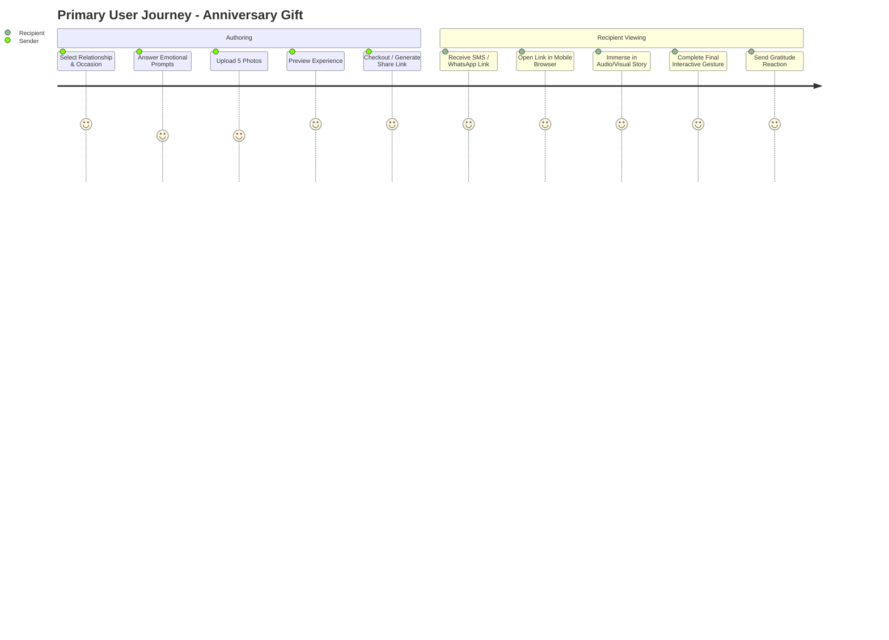
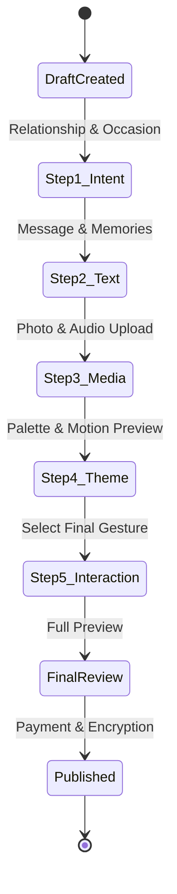

# Momenta — Product Requirements Document (PRD)

---

## 1. Product Summary & Scope

Momenta allows senders to compose emotionally evocative digital experiences for recipients. 
The product consists of three core applications:

1. **Sender Studio**: Web-based conversational wizard for message authoring, media upload, audio pairing, and preview.
2. **Story Delivery Engine**: High-performance, edge-rendered experience viewer optimized for mobile touch interaction and desktop browser viewing.
3. **Admin & Analytics Gateway**: Secure management suite for content moderation, system telemetry, abuse detection, and delivery monitoring.

---

## 2. Target Users & Use Cases

### Key Use Cases
- **Romantic Milestones**: Anniversaries, proposals, long-distance love letters.
- **Support & Solace**: Get well soon, condolences, quiet encouragement during hard times.
- **Celebration & Joy**: Birthdays, promotions, graduations, retirement farewells.
- **Reconciliation & Apology**: Sincere, reflective personal notes requiring ambient space.

---

## 3. Comprehensive Feature Specifications

### 3.1 Sender Studio (Creation Wizard)

#### Requirements & Business Rules

- **BR-SS-001 (Relationship Matrix)**: The wizard must support 12 distinct relationship classifications (Partner, Parent, Child, Best Friend, Mentor, Sibling, Colleague, Long-Distance Friend, Self, etc.).
- **BR-SS-002 (Emotional Intensity Slider)**: A 5-point scale (Subtle, Heartfelt, Deeply Emotional, Playful, Cinematic) adjusting animation velocity, music crossfade curve, and typography weight.
- **BR-SS-003 (Media Constraints)**: Maximum 10 photos per experience (JPEG/PNG/WEBP/HEIC up to 15MB each). Server automatically generates WebP variants at 1080p, 720p, and blurred placeholder thumbnail resolutions.
- **BR-SS-004 (Audio Pairing)**: Support for licensed royalty-free ambient audio tracks categorized by emotion, or custom audio upload (MP3/AAC up to 20MB with dynamic waveform visualization).

---

### 3.2 Story Delivery Engine (Recipient View)

#### Requirements & Business Rules

- **BR-SDE-001 (Zero Installation)**: Must run directly in any modern web browser (iOS Safari, Android Chrome, Desktop Edge/Chrome/Firefox/Safari) without app installation or login.
- **BR-SDE-002 (Autoplay Audio Handling)**: Strict compliance with Web Audio Autoplay policies. Displays an initial atmospheric splash screen with an explicit tap gesture ("Tap to Open") to initialize Web Audio API `AudioContext`.
- **BR-SDE-003 (Adaptive Pacing)**: Story advances via touch swipes, tap gestures, or scroll triggers, with an automatic cinematic slideshow backup mode.
- **BR-SDE-004 (The Final Gesture)**: The story culminates in a responsive interaction chosen by the sender:
  - *Wax Seal Break* (Particle physics canvas break)
  - *Candle Blowout* (Microphone audio level input or press-and-hold)
  - *Ribbon Unravel* (Gesture drag physics)
  - *Glowing Envelope Open* (3D card flip using CSS transforms)

---

## 4. Non-Functional Requirements (NFRs)

```mermaid
gantt
    title System Performance SLA Tolerances
    dateFormat  SS
    axisFormat %S sec

    section Page Load (TTFB)
    Edge Server Response :active, 00, 01
    section Asset Hydration
    Preload First Image & Audio Stem :active, 01, 02
    section Animation FPS
    60 FPS Rendering Maintenance :active, 00, 05
```

1. **Latency & TTFB**:
   - Initial HTML load < 150ms via Vercel / Cloudflare Edge CDN.
   - Time To Interactive (TTI) < 1.2s on standard 4G mobile connection.
2. **Frame Rate (FPS)**:
   - Enforce minimum 55 FPS during WebGL background shaders and CSS animations on mid-tier mobile devices (iPhone 11 / Snapdragon 765G equivalent).
3. **Availability & Resilience**:
   - 99.95% uptime SLA for Story Delivery API.
   - Graceful offline fallback: Cached web worker presentation state if connection drops mid-story.
4. **Security & Privacy**:
   - Zero storage of raw unhashed passwords or plain-text recipient metadata.
   - AES-256 encryption at rest for user media assets in Cloud Storage.
   - Link Token Entropy: 22-character Nanoid providing $2^{131}$ unique combinations, preventing brute-force enumeration attacks.

---

## 5. User Acceptance Criteria (UAC) Matrix

| ID | Module | Scenario | Expected Behavior | Acceptance Standard |
| :--- | :--- | :--- | :--- | :--- |
| **UAC-01** | Studio | User uploads HEIC photo from iPhone. | Client/Server automatically converts image to WebP with orientation metadata preserved. | Image renders cleanly within < 2s with zero distortion. |
| **UAC-02** | Delivery | Recipient opens link on iOS Safari with Low Power Mode. | Shader fallback activates (CSS gradients substituted for Heavy WebGL shaders). | Frame rate remains > 50 FPS without device thermal throttling. |
| **UAC-03** | Delivery | Recipient reaches final gesture (Blow Out Candle). | Mic permission requested gracefully; candle flame extinguishes upon audio threshold > 0.65. | Visual flame particles dissipate with acoustic swell. |
