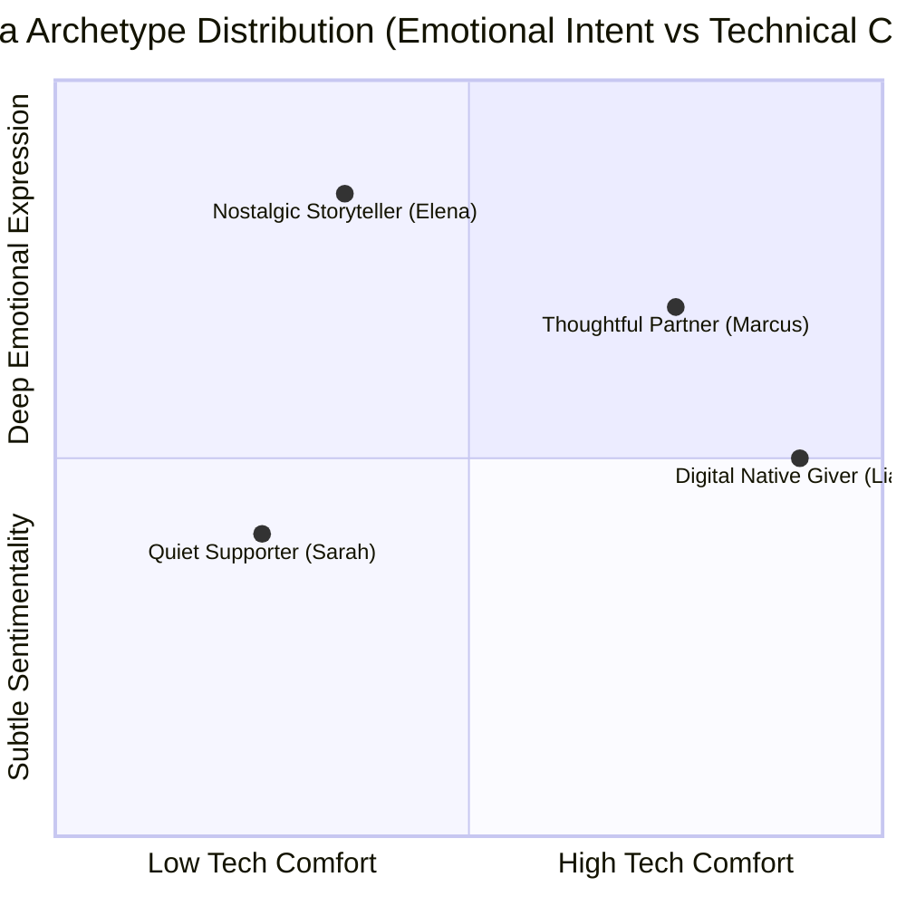
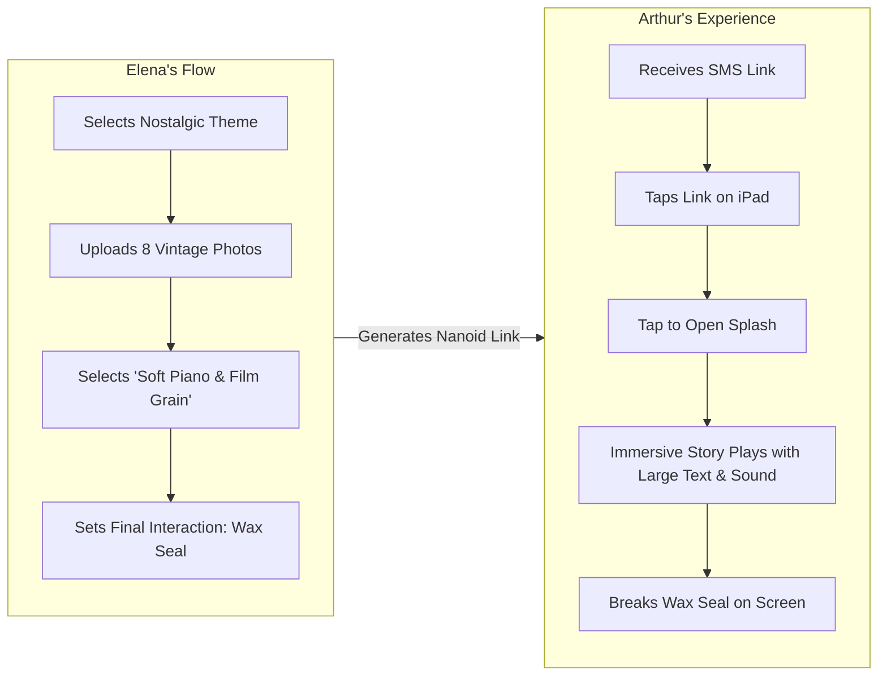

# Momenta — User Personas & Archetypes

---

## 1. Persona Matrix Overview

Momenta caters to two distinct operational roles: **Senders** (Authors seeking emotional depth) and **Recipients** (Consumers receiving the narrative experience).

---

## 2. Detailed Archetype Profiles

### Archetype 1: Elena Rostova — The Nostalgic Memory Keeper (Sender)

- **Demographics**: Age 34, Product Designer, Married.
- **Goal**: Wants to mark her 10th wedding anniversary with a deeply personalized reflection of shared memories, far beyond a physical card or generic social media post.
- **Pain Points**: Standard ecards feel tacky and commercialized. Traditional video editors take 10+ hours to compile keyframes and audio tracks.
- **Emotional Drivers**: Vulnerability, shared nostalgia, milestone reflection.
- **Tech Proficiency**: High (uses Figma, Mac OS, mobile web daily).
- **Primary Device**: iPhone 15 Pro, MacBook Air.
- **Key Requirement**: Precision control over photo sequencing, typography tone, and ambient audio crossfading.

---

### Archetype 2: Marcus Vance — The Expressive Pragmatist (Sender)

- **Demographics**: Age 28, Software Engineer, Long-distance relationship.
- **Goal**: Wants to send a heartfelt gesture for his partner’s birthday while she is traveling abroad.
- **Pain Points**: Struggle to articulate raw emotion in standard plain text messages. Wants something visually stunning without having to manually code WebGL shaders or design layouts.
- **Emotional Drivers**: Delight, surprise, romantic connection across distance.
- **Tech Proficiency**: Very High.
- **Primary Device**: Android Pixel 8 Pro, Chrome Desktop.
- **Key Requirement**: Instant mobile delivery link, seamless WebAudio playback, zero lag on high-refresh screens.

---

### Archetype 3: Arthur Pendelton — The Recipient (Recipient)

- **Demographics**: Age 68, Retired Educator.
- **Goal**: Wants to view a milestone message sent by his granddaughter easily without frustration or software downloads.
- **Pain Points**: Confused by popups, app store downloads, logins, password resets, or tiny text.
- **Emotional Drivers**: Joy, feeling valued by family, effortless connection.
- **Tech Proficiency**: Low to Moderate (uses iPad for email and news).
- **Primary Device**: iPad Air (Safari).
- **Key Requirement**: High accessibility (WCAG AAA contrast options), large touch targets, automatic audio initiation with clear prompts, zero friction login requirements.

---

## 3. Behavioral Scenarios & Edge Cases

1. **Low Connectivity Scenario**: Arthur opens the link while on a 3G cellular network. The system dynamically serves 720p WebP images and compressed audio stems, keeping initial payload under 2MB.
2. **Audio Autoplay Blocked Scenario**: Browser blocks WebAudio. The application displays a graceful pulse ring button: *"Tap anywhere to begin the music & story"*.
3. **Accessibility Scenario**: Arthur enables high-contrast text mode. The application adjusts dynamic background opacity to enforce minimum 7:1 contrast ratio for all story text blocks.
