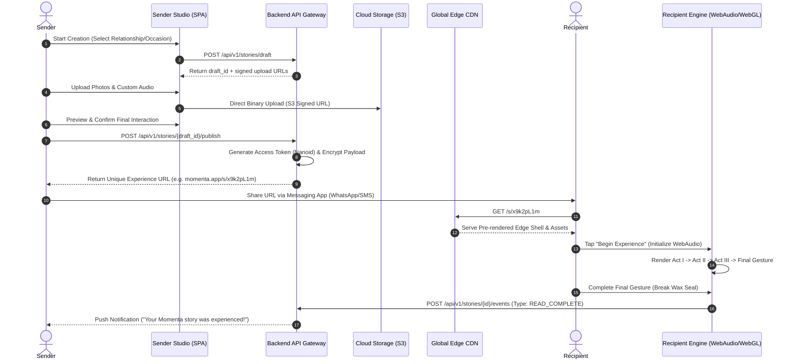
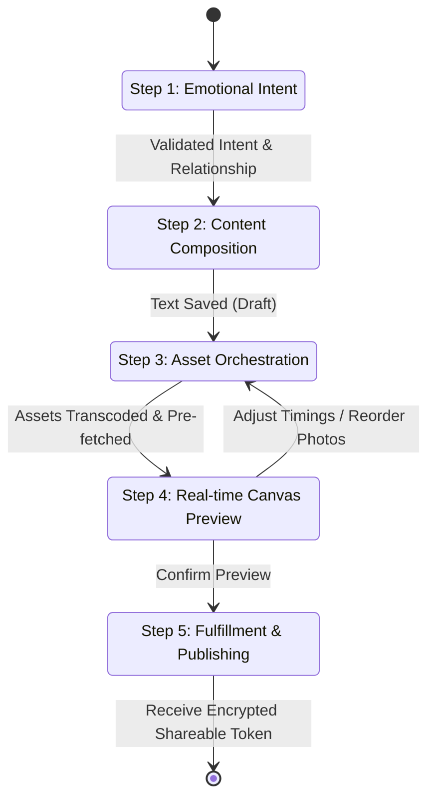
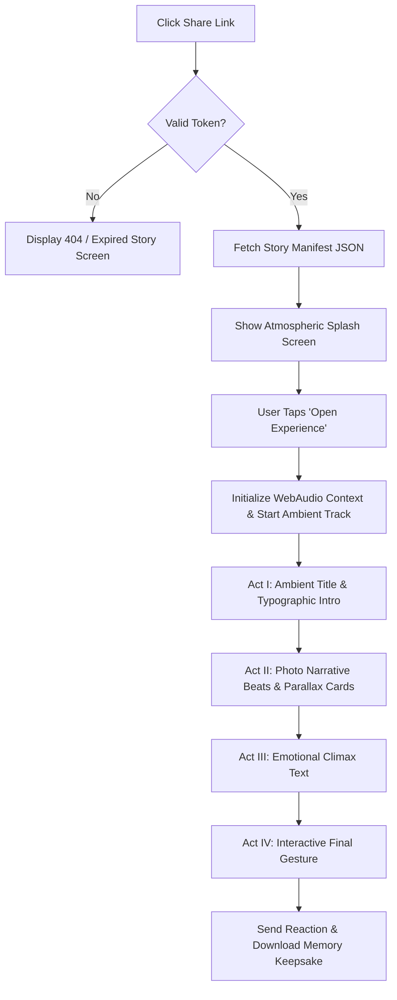

# Momenta — User Journeys & End-to-End Workflows

---

## 1. Primary Workflows Overview

Momenta orchestrates two critical end-to-end paths:
1. **Creation & Delivery Journey (Sender)**
2. **Story Consumption & Interaction Journey (Recipient)**

---

## 2. Sender Creation Journey (Step-by-Step)

### Flow Breakdown & Business Validation

| Step | User Action | System Operations | Error Recovery |
| :--- | :--- | :--- | :--- |
| **01. Intent** | Selects relationship ("Partner") & occasion ("Anniversary"). | Initializes draft record in database (`status: DRAFT`). Applies default theme tokens. | Network failure auto-retries using local storage fallback. |
| **02. Composition** | Enters personal message, key dates, and emotional quotes. | Runs client-side character validation and tone classifier (Emotion Engine). | Truncates text over 2,000 characters with visual indicator. |
| **03. Assets** | Selects 5 photos and background audio track. | Generates client-side thumbnails; requests signed S3 PUT URLs. Transcodes audio waveforms. | If upload fails, retries upload with exponential backoff. |
| **04. Preview** | Views real-time WebGL/CSS preview in simulated mobile frame. | Executes local WebAudio synth and layout preview. | Frame drops > 10% trigger low-spec shader preview automatically. |
| **05. Publish** | Clicks "Lock & Send". | Transitions state to `PUBLISHED`. Generates 128-bit Nanoid link token. | Idempotency key prevents double billing/publishing. |

---

## 3. Recipient Consumption Journey

### Recipient Interaction Rules

1. **Autoplay Safeguard**: Web browser audio policies forbid unprompted audio playback. The entry screen presents a full-bleed atmospheric ambient visual with a single pulsing trigger button (`"Open Momenta"`). Tapping this button executes `audioCtx.resume()`.
2. **Gesture Mechanics**: 
   - Mobile: Swipe up / Tap side controls story pacing.
   - Desktop: Scroll wheel or Arrow keys control timeline progression.
3. **One-Time Interaction Rule**: Senders can configure *Single-View Mode*. After the final gesture is executed, the server marks the token state as `CONSUMED`. Subsequent access displays a read-only archived keepsake view without the interactive reveal state.
