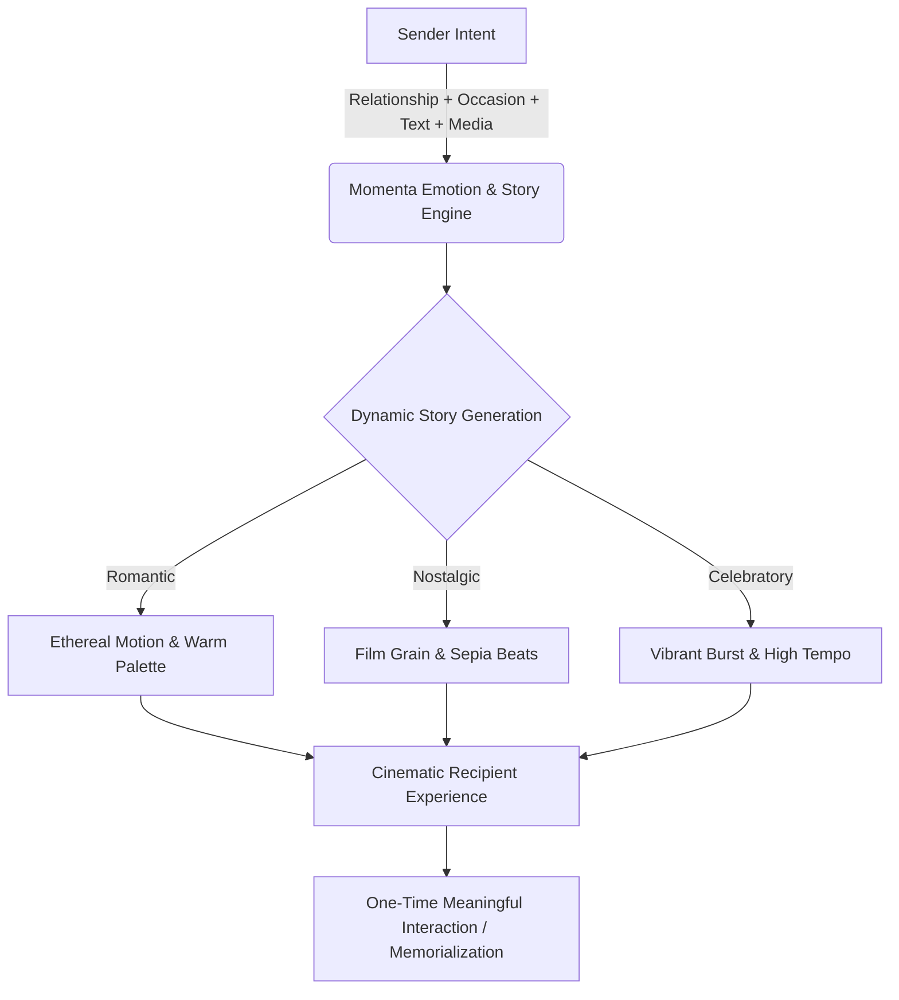
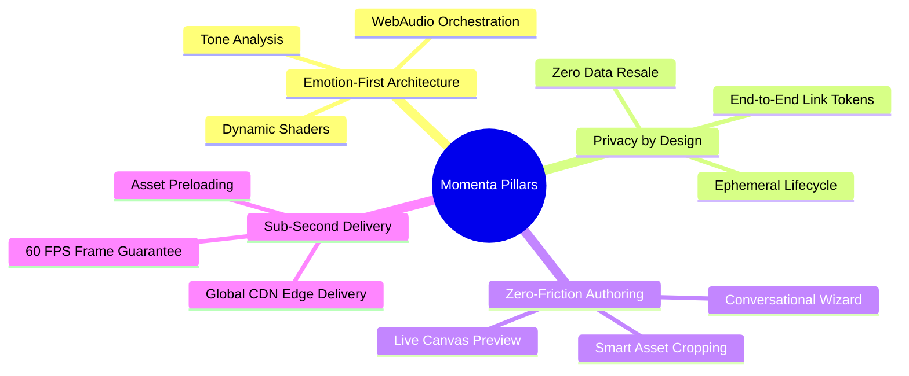

# Momenta — Product Vision & Philosophy

> **Tagline**: *"Your feelings, on a page."*

---

## 1. Executive Summary

**Momenta** is an emotion-first digital storytelling platform designed to translate raw human affection, gratitude, nostalgia, and love into personalized, cinematic web experiences.

Modern web communications—text messages, ecards, and static greeting templates—suffer from low emotional dynamic range. They are static, transactional, and quickly forgotten. Momenta disrupts this paradigm by creating **ephemeral, immersive, interactive micro-experiences** tailored to the precise emotional intent of the sender and the unique context of the recipient.

---

## 2. What Momenta IS vs. What Momenta IS NOT

| Feature Dimension | What Momenta IS | What Momenta IS NOT |
| :--- | :--- | :--- |
| **Core Intent** | An emotional narrative orchestration system. | A digital greeting card catalog. |
| **Content Model** | Dynamic, motion-driven, audio-synced storytelling beats. | Static PDF/HTML templates with image drops. |
| **User Interaction** | Guided emotional reveal leading to a singular core interaction. | Web page builder with drag-and-drop widgets. |
| **Recipient Experience** | Full-screen, cinema-grade presentation tailored to mobile/desktop. | A blog post or link shortener target. |
| **Lifecycle** | Ephemeral, protected, non-indexed, high-privacy experience. | Public social network feed or permanent forum post. |

---

## 3. The Core Value Proposition

Momenta unlocks high-fidelity emotional expression for non-designers.

1. **Zero Design Friction**: The sender never drags elements or picks fonts. They answer key emotional prompts (relationship, occasion, memory beats, music choices).
2. **Algorithmic Choreography**: The **Story & Emotion Engine** maps textual tone, memory milestones, and media assets to real-time GL shaders, CSS micro-animations, typography pairings, and web audio stems.
3. **The Reveal Moment**: The recipient does not merely read a message; they experience a multi-act narrative culminating in an interactive physical-like gesture (e.g., breaking a wax seal, unlocking a digital vault, blowing out an interactive candle).

---

## 4. Emotional Dynamic Range (EDR) Philosophy

Traditional messages deliver content instantaneously without buildup. Momenta enforces **Pacing and Anticipation**:

- **Act I: The Hook & Ambient Atmosphere** (Tone-setting colors, ambient audio, slow typographic fade-in).
- **Act II: The Narrative Build** (Sequenced media slides with parallax depth, interactive memories, emotion-driven velocity changes).
- **Act III: The Climax** (The message core, glowing typography, acoustic climax).
- **Act IV: The Singular Interaction & Memorialization** (Custom CTA, physical gesture, downloadable keepsake token).

---

## 5. Architectural & Strategic Pillars

1. **Emotion-First Architecture**: Every subsystem (frontend, database schemas, animation state machines) evaluates performance through the lens of emotional resonance.
2. **Privacy by Default**: Messages contain intimate personal memories. All links use cryptographically random high-entropy tokens (`nanoid` 128-bit standard), auto-expiring access, and encrypted storage.
3. **60 FPS Performance Guarantee**: Interactive storytelling fails if frames drop. The system enforces strict WebGL hardware acceleration, CSS containment, and dynamic bundle splitting.
