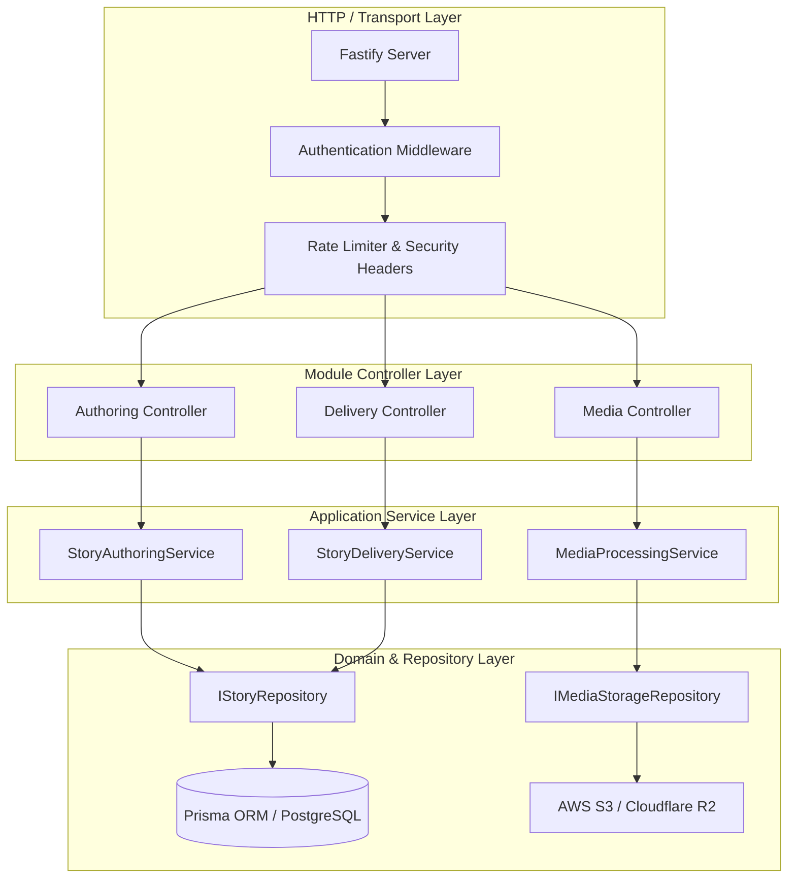
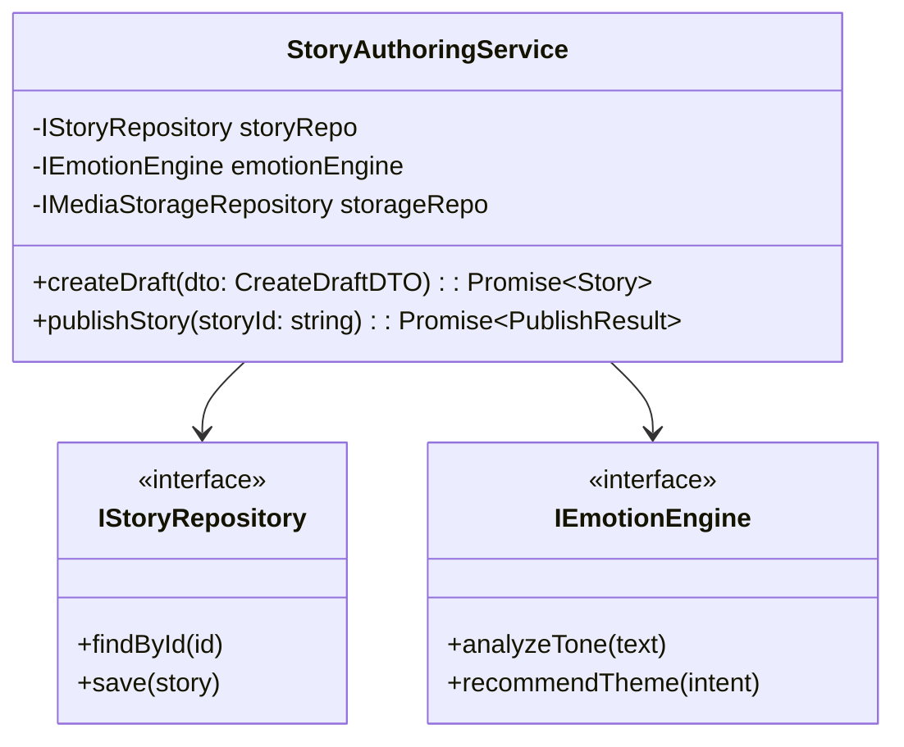
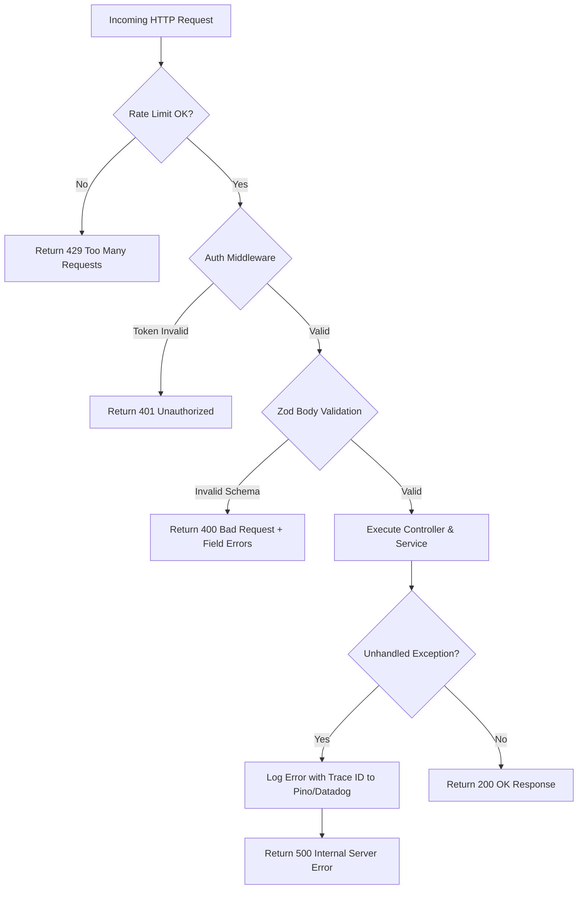
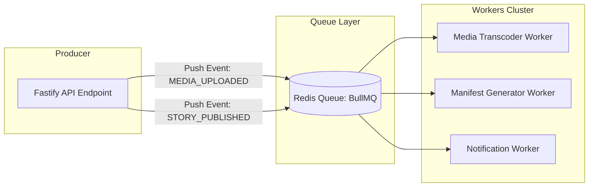

# Momenta — Backend Architecture & Service Design

---

## 1. Modular Backend Design (Modulith)

The backend is architected as a **Clean Modular Monolith (Modulith)** using Fastify / Node.js and TypeScript, organized into domain modules with strict encapsulation interfaces.



---

## 2. Layer Definitions & Contracts

### 2.1 Repository Pattern Implementation

All database interactions pass through typed Repository interfaces. Direct ORM calls inside services are strictly forbidden.

```typescript
// Shared Domain Abstraction
export interface IStoryRepository {
  findById(id: string): Promise<Story | null>;
  findByAccessToken(token: string): Promise<Story | null>;
  save(story: Story): Promise<void>;
  updateStatus(id: string, status: StoryStatus): Promise<void>;
  delete(id: string): Promise<boolean>;
}
```

```typescript
// Infrastructure Concrete Implementation
export class PrismaStoryRepository implements IStoryRepository {
  constructor(private readonly prisma: PrismaClient) {}

  async findByAccessToken(token: string): Promise<Story | null> {
    const record = await this.prisma.story.findUnique({
      where: { accessToken: token },
      include: { nodes: true, media: true },
    });
    if (!record) return null;
    return StoryMapper.toDomain(record);
  }

  async save(story: Story): Promise<void> {
    const data = StoryMapper.toPersistence(story);
    await this.prisma.story.upsert({
      where: { id: story.id },
      create: data,
      update: data,
    });
  }

  async updateStatus(id: string, status: StoryStatus): Promise<void> {
    await this.prisma.story.update({
      where: { id },
      data: { status },
    });
  }

  async findById(id: string): Promise<Story | null> {
    const record = await this.prisma.story.findUnique({ where: { id } });
    return record ? StoryMapper.toDomain(record) : null;
  }

  async delete(id: string): Promise<boolean> {
    const res = await this.prisma.story.delete({ where: { id } });
    return !!res;
  }
}
```

---

## 3. Dependency Injection Architecture

Momenta uses lightweight constructor-based Dependency Injection managed by `tsyringe` or native Fastify plugin decorators.



---

## 4. Middleware & Error Handling Pipeline



### Global Error Contract Schema

```json
{
  "success": false,
  "error": {
    "code": "STORY_NOT_FOUND",
    "message": "The requested story experience could not be located or has expired.",
    "traceId": "req-94a2-11ee-b9d1-0242ac120002",
    "timestamp": "2026-07-22T16:05:23.000Z",
    "details": []
  }
}
```

---

## 5. Async Queue & Background Jobs (BullMQ + Redis)



- **Media Transcoder Queue**: Concurrently converts raw image uploads into responsive WebP resolutions (`1920x1080`, `1280x720`, `480x270` blurred placeholders). Strips EXIF metadata.
- **Manifest Builder Queue**: Compiles story nodes, timing intervals, audio wave data, and emotion color tokens into a single static JSON manifest deployed to Edge KV.
