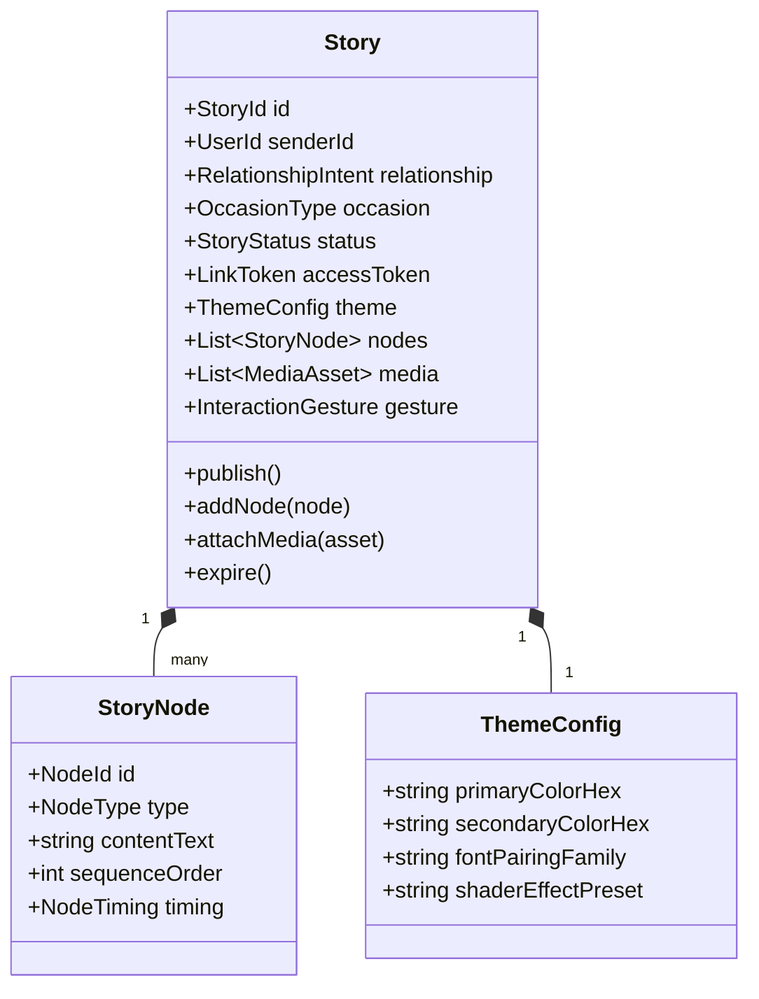
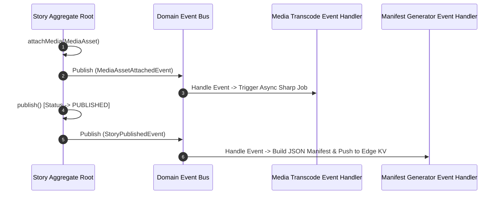

# Momenta — Business Domain & Domain Model

---

## 1. Domain Bounded Contexts

Momenta’s business domain is segregated into four primary Bounded Contexts:

```mermaid
graph TD
    subgraph Authoring Context
      A[Story Draft Aggregate] --> B[Message Content Value Object]
      A --> C[Relationship Intent Entity]
    end

    subgraph Emotion & Theme Context
      D[Emotion Engine Aggregate] --> E[Palette Token Set Value Object]
      D --> F[Animation Tempo Curve Value Object]
    end

    subgraph Media Context
      G[Media Asset Aggregate] --> H[Transcoded Variant Entity]
      G --> I[Audio Stem Value Object]
    end

    subgraph Delivery Context
      J[Recipient Experience Aggregate] --> K[Link Token Value Object]
      J --> L[Interaction Audit Log Entity]
    end

    Authoring Context -->|Publishes Draft| Emotion & Theme Context
    Authoring Context -->|Attaches Media| Media Context
    Media Context & Emotion & Theme Context -->|Generates Manifest| Delivery Context
```

---

## 2. Aggregate Roots & Entity Definitions

### 2.1 Story Aggregate Root

The `Story` aggregate root encapsulates the complete lifecycle, business invariants, and node structure of a Momenta experience.



---

## 3. Core Domain Value Objects & Invariants

```typescript
// Domain Value Objects with Strict Invariants

export class LinkToken {
  private readonly value: string;

  constructor(value: string) {
    if (!value || value.length < 16) {
      throw new Error("LinkToken must be a cryptographic Nanoid of at least 16 characters");
    }
    this.value = value;
  }

  public getValue(): string {
    return this.value;
  }

  public equals(other: LinkToken): boolean {
    return this.value === other.getValue();
  }
}

export type StoryStatus = 'DRAFT' | 'PROCESSING' | 'PUBLISHED' | 'EXPIRED' | 'FLAGGED_ABUSE';

export interface NodeTiming {
  durationMs: number;
  fadeInDelayMs: number;
  crossfadeDurationMs: number;
}

export class MessageContent {
  private readonly text: string;

  constructor(text: string) {
    const trimmed = text.trim();
    if (trimmed.length === 0) {
      throw new Error("Message content cannot be empty.");
    }
    if (trimmed.length > 2500) {
      throw new Error("Message content exceeds maximum allowed length of 2500 characters.");
    }
    this.text = trimmed;
  }

  public getText(): string {
    return this.text;
  }
}
```

---

## 4. Domain Events Lifecycle



### Domain Event Definitions
- `StoryDraftCreatedEvent`
- `MediaAssetAttachedEvent`
- `StoryPublishedEvent`
- `StoryExperiencedEvent` (Fired when recipient completes final gesture)
- `StoryExpiredEvent`
