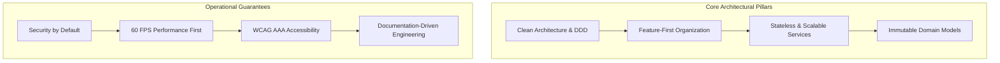
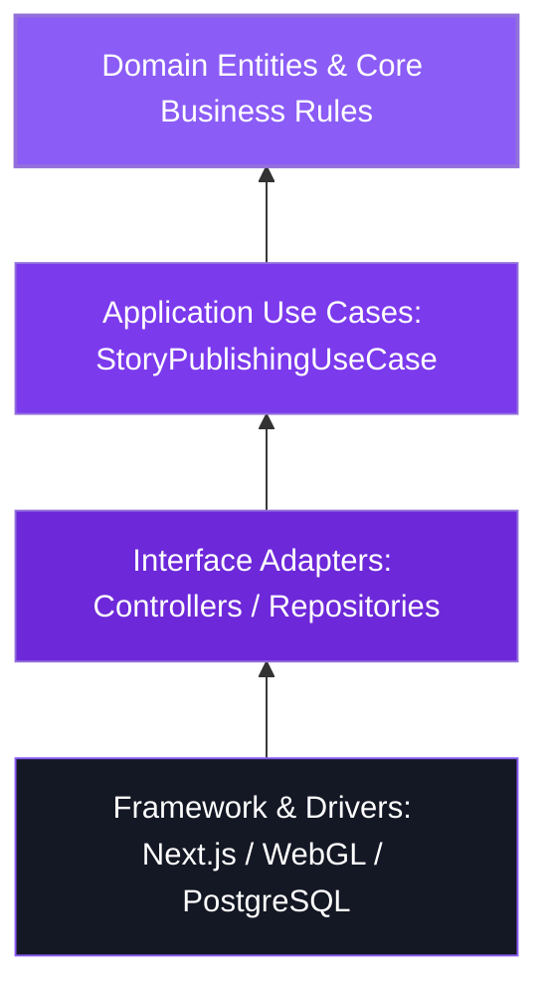

# Momenta — Engineering Principles & Architectural Mandates

---

## 1. Architectural Philosophy

Momenta’s engineering culture follows Stripe- and Linear-grade documentation and implementation standards. Every system component must adhere to explicit software architectural design rules to guarantee longevity, testability, security, and extreme performance.



---

## 2. Fundamental Software Principles

### 2.1 SOLID Principles Application

1. **Single Responsibility Principle (SRP)**:
   - *Backend*: A service handles business logic; a repository handles data persistence; a controller handles HTTP mapping. No database queries in controllers or HTTP parsing in services.
   - *Frontend*: A UI component presents view logic; a hook manages state and side-effects; an engine adapter manages WebGL/WebAudio render loops.
2. **Open/Closed Principle (OCP)**:
   - The Story Engine is extensible for new gesture types (`WaxSeal`, `CandleBlowout`, `RibbonUnravel`) via a polymorphic `IGestureStrategy` interface without altering core narrative timeline runners.
3. **Liskov Substitution Principle (LSP)**:
   - All storage implementations (`S3StorageRepository`, `LocalStorageRepository`, `CloudflareR2Repository`) implement `IStorageRepository` and pass identical integration test suites.
4. **Interface Segregation Principle (ISP)**:
   - APIs expose granular interfaces. Senders receive `DraftAuthoringAPI`; Recipients receive read-only `StoryDeliveryAPI`.
5. **Dependency Inversion Principle (DIP)**:
   - High-level domain services depend on domain abstractions (`IEmotionAnalyzer`, `IMediaTranscoder`), never on concrete third-party SDKs directly.

---

### 2.2 Clean Architecture & Layering



#### Layer Boundary Rules
- **Domain Layer**: Zero external dependencies (no ORMs, no HTTP frameworks, no WebGL refs). Pure TypeScript classes/types.
- **Application Layer**: Contains Use Case handlers (`CreateStoryDraftUseCase`, `RenderStoryManifestUseCase`). Accepts domain interfaces.
- **Infrastructure Layer**: Implements persistence (Prisma / Kysely), Cloudflare Workers, S3 SDKs, and WebAudio drivers.

---

### 2.3 Feature-First Folder Organization

Rather than grouping by file type (`/controllers`, `/services`, `/models`), Momenta structures both backend and frontend code by **Feature Domains**:

```text
src/
├── modules/
│   ├── authoring/
│   │   ├── domain/
│   │   ├── application/
│   │   ├── infrastructure/
│   │   └── presentation/
│   ├── emotion-engine/
│   ├── delivery/
│   └── media-processing/
└── shared/
    ├── domain/
    ├── infrastructure/
    └── ui-system/
```

---

## 3. Core Software Engineering Tactics

| Tactical Rule | Description & Enforced Standard |
| :--- | :--- |
| **KISS (Keep It Simple)** | Avoid premature microservices. Monolith-first with strict modular boundaries (`modulith`) until scale dictates service extraction. |
| **YAGNI (You Aren't Gonna Need It)** | Do not build multi-tenant enterprise RBAC or white-label customization until explicitly required by product roadmap. |
| **DRY (Don't Repeat Yourself)** | Shared validation schemas (via `Zod`) used across client frontend and backend REST controllers. |
| **Composition Over Inheritance** | Use functional composition and component mixins over deep class hierarchies. |
| **Stateless Services** | Application servers store zero session state in local memory. All transient states live in Redis or signed client tokens. |
| **Immutable Domain Models** | Domain objects use `Readonly<T>` types. State changes produce fresh copies via pure reducer functions. |

---

## 4. Default Quality & Operational Commitments

1. **Performance-First Mindset**: Bundle budgets strictly enforced (< 120KB initial JS gzipped for Recipient Engine).
2. **Security by Default**: All input sanitized via Zod; OWASP Top 10 mitigations automated in middleware; Zero raw database queries without parameterized SQL.
3. **Accessibility by Default**: High contrast modes, keyboard navigation, and screen reader aria-labels mandatory for all UI components.
4. **Documentation-First Development**: No PR merged without updating corresponding Docusaurus architecture docs and API specifications.
