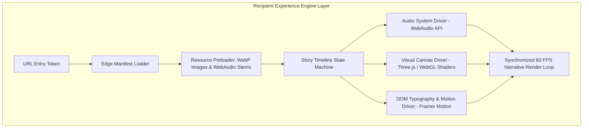
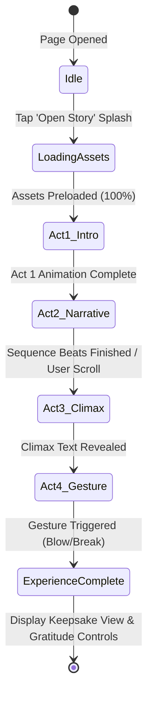
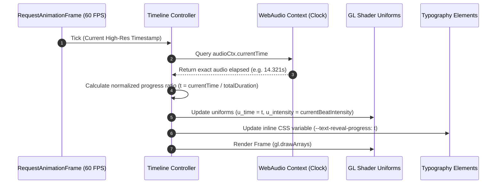

# Momenta — Frontend Architecture & Client Engineering

---

## 1. Frontend System Architecture Overview

Momenta’s client layer consists of two distinct single-page application frameworks tuned for different operational priorities:

1. **Sender Studio**: Productivity SPA (React 18+, TypeScript, TailwindCSS, Zustand, Radix UI) focused on rapid wizard authoring, form state persistence, and real-time live preview.
2. **Recipient Experience Engine**: High-performance rendering engine (Vanilla JS + HTML5 WebGL + WebAudio API + Framer Motion) designed for sub-second load times, 60 FPS transitions, zero UI clutter, and mobile touch interactions.



---

## 2. Component Layering & State Management

```mermaid
graph BT
    subgraph UI View Layer
      V1[Wizard Step Views]
      V2[Live Preview Canvas]
      V3[Gesture Overlays]
    end

    subgraph State Management (Zustand + React Query)
      S1[Draft State Store: Wizard Answers & Nodes]
      S2[Server Sync Store: React Query Mutation Hooks]
      S3[Audio/Visual State Store: Timeline Progress & FPS Monitor]
    end

    subgraph Engine & Driver Layer
      D1[WebAudio Engine Instance]
      D2[WebGL Particle Shader Instance]
      D3[Touch & Pointer Gesture Engine]
    end

    V1 --> S1
    V2 --> S3
    S1 --> S2
    S3 --> D1
    S3 --> D2
    V3 --> D3
```

---

## 3. The Story Timeline State Machine

The Recipient Experience is driven by a strict Finite State Machine (FSM) implemented via XState or a lightweight custom reducer to prevent invalid state transitions or out-of-order audio cues.



---

## 4. Audio-Visual Synchronization Engine



### Critical Synchronization Code Contract

```typescript
export interface ITimelineDriver {
  getCurrentTime(): number;
  seekTo(seconds: number): void;
  play(): Promise<void>;
  pause(): void;
  subscribeBeatUpdate(callback: (beat: BeatEvent) => void): () => void;
}

export class WebAudioTimelineDriver implements ITimelineDriver {
  private ctx: AudioContext;
  private audioBuffer: AudioBuffer | null = null;
  private sourceNode: AudioBufferSourceNode | null = null;
  private startTime: number = 0;

  constructor() {
    this.ctx = new (window.AudioContext || (window as any).webkitAudioContext)();
  }

  getCurrentTime(): number {
    if (this.ctx.state !== 'running') return 0;
    return this.ctx.currentTime - this.startTime;
  }

  async play(): Promise<void> {
    if (this.ctx.state === 'suspended') {
      await this.ctx.resume();
    }
    this.startTime = this.ctx.currentTime;
  }

  seekTo(seconds: number): void {
    // Implements precise seeking logic
  }

  pause(): void {
    this.ctx.suspend();
  }

  subscribeBeatUpdate(callback: (beat: BeatEvent) => void): () => void {
    // Subscribes beat analyzer node
    return () => {};
  }
}
```

---

## 5. Performance & Memory Hygiene

1. **Asset Recycling**: WebGL textures are explicitly disposed (`texture.dispose()`, `geometry.dispose()`) when transitioning between acts to avoid iOS Safari memory limit crashes (256MB limit on web worker context).
2. **CSS Containment**: Story nodes utilize CSS properties `contain: strict;` and `will-change: transform, opacity;` to enforce GPU layer promotion without layout reflows.
3. **Tree-Shaking Budget**: High-weight libraries (e.g. `three.js`) are imported via micro-modules (`three/src/renderers/WebGLRenderer`) rather than root package exports, saving over 400KB in bundle size.
