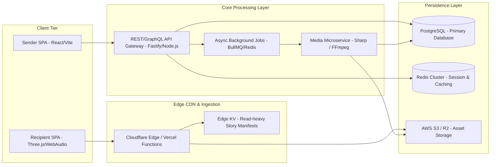
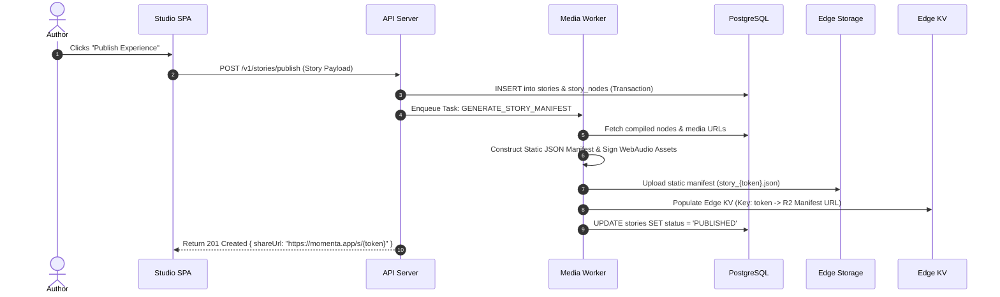

# Momenta — Overall System Architecture

---

## 1. High-Level Architecture Topology

Momenta employs an **Edge-Accelerated Hybrid Architecture**. High-throughput story consumption is served via global edge workers (Cloudflare / Vercel Edge), while authoring, media processing, and analytics are handled by scalable containerized backend services.

---

## 2. Detailed Component Hierarchy

---

## 3. Data Flow & Subsystem Communication

### 3.1 Story Publishing & Manifest Generation

---

## 4. Architecture Tradeoffs & Rationale

| Architecture Decision | Chosen Approach | Alternative Considered | Trade-off Rationale |
| :--- | :--- | :--- | :--- |
| **Delivery Model** | Static Manifest at Edge CDN + Edge KV | Dynamic Server-Side Rendering (SSR) per request | Serving static JSON manifests from Cloudflare Edge reduces recipient TTFB to < 50ms globally and eliminates backend DB load during viral spikes. |
| **Media Processing** | Asynchronous Worker Queue (BullMQ + Sharp) | Synchronous client-side upload & resize | Processing on backend workers ensures uniform WebP/AVIF output quality, metadata stripping (EXIF privacy), and fallback thumbnail generation regardless of client device CPU. |
| **Database Architecture** | PostgreSQL with JSONB story nodes | Pure NoSQL Document Store (MongoDB) | Relational integrity for user accounts, billing, audit logs, and access permissions, with JSONB flexibility for dynamic story engine beats. |
| **State Synchronization** | Optimistic UI updates with HTTP REST | Persistent WebSockets for draft editing | WebSockets add server memory overhead; drafts are authored single-user, making REST with debounce and local storage autosave vastly simpler and resilient. |
