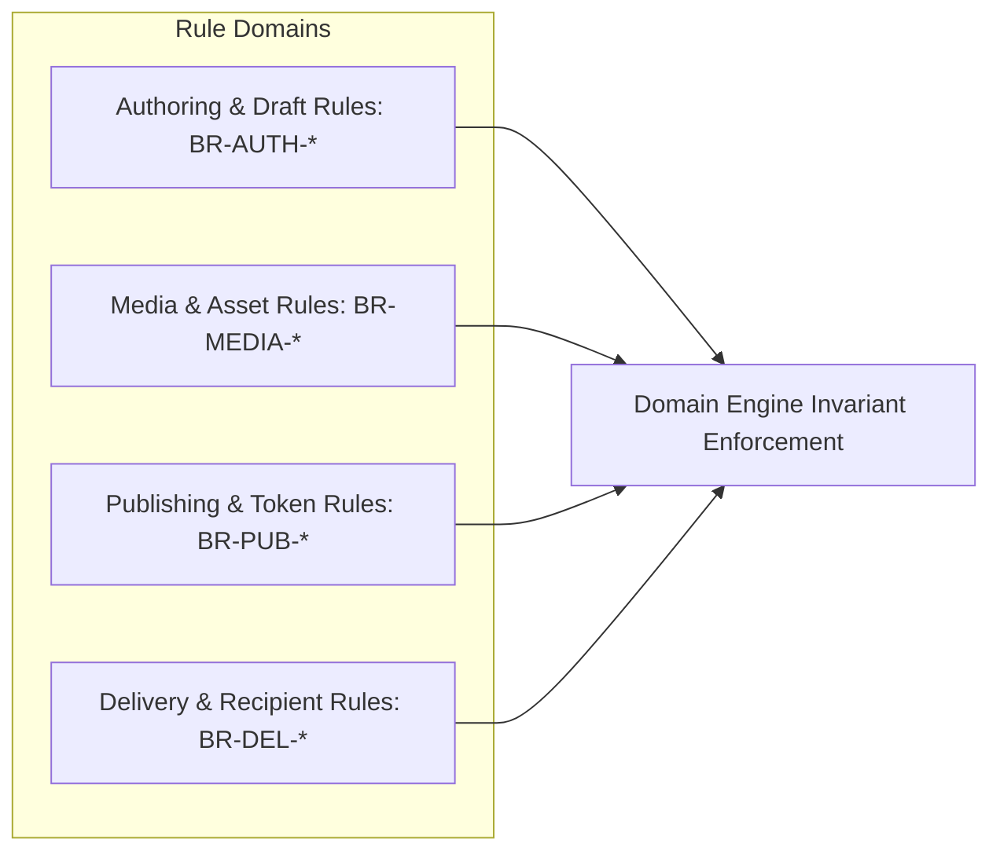

# Momenta — System Business Rules Registry

---

## 1. Governance & Rules Directory

This document serves as the authoritative single source of truth for all business logic rules enforced by backend domain services and frontend state machines.

---

## 2. Rule Registry Matrix

| Rule ID | Category | Name | Description & Enforced Limits |
| :--- | :--- | :--- | :--- |
| **BR-AUTH-001** | Authoring | Max Draft Count | A free-tier sender account may hold a maximum of 5 active unpublished drafts simultaneously. |
| **BR-AUTH-002** | Authoring | Node Count Limit | A story experience must contain a minimum of 2 nodes and a maximum of 10 nodes. |
| **BR-AUTH-003** | Authoring | Text Character Bounds | Individual story text nodes must contain between 1 and 800 characters; total story text cannot exceed 2,500 characters. |
| **BR-MEDIA-001** | Media | Image Count Cap | A story experience can include up to 10 photos maximum. |
| **BR-MEDIA-002** | Media | Supported Formats | Accepted image formats: JPEG, PNG, WEBP, HEIC. Accepted audio formats: MP3, AAC, WAV. |
| **BR-MEDIA-003** | Media | File Size Limit | Max single image file size: 15MB. Max single audio file size: 25MB. |
| **BR-PUB-001** | Publishing | Expiration Default | Standard published story links remain accessible for 365 days from publication unless extended or deleted by sender. |
| **BR-PUB-002** | Publishing | Token Uniqueness | Access tokens must use 22-character Nanoids guaranteeing zero collision across $10^9$ active records. |
| **BR-DEL-001** | Delivery | Burn-on-Read | When `burnOnRead: true` is configured, the manifest token is purged from Edge KV 60 seconds after the recipient completes the final gesture. |
| **BR-DEL-002** | Delivery | Autoplay Requirement | Web Audio initialization must occur as a direct response to a physical user gesture (click/tap) on the landing splash screen. |
