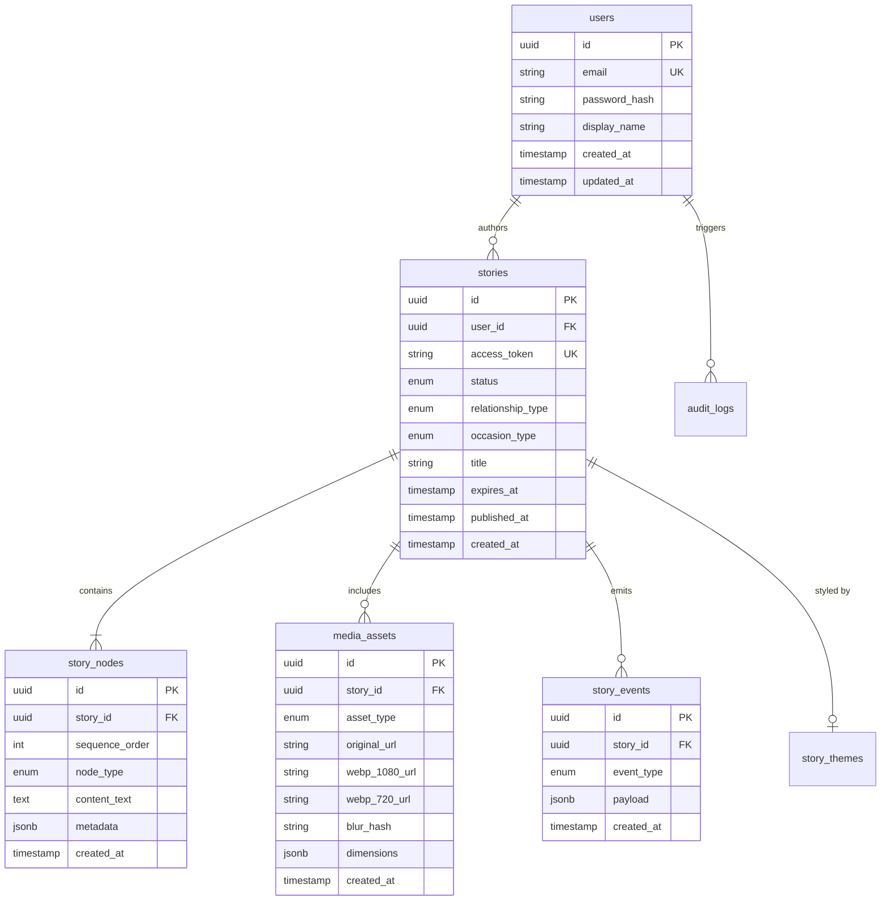

# Momenta — Database Architecture & Schema Specification

---

## 1. Database Entity-Relationship (ER) Diagram



---

## 2. PostgreSQL DDL Specification

```sql
-- Extension Setup
CREATE EXTENSION IF NOT EXISTS "uuid-ossp";
CREATE EXTENSION IF NOT EXISTS "pgcrypto";

-- Enums
CREATE TYPE user_role AS ENUM ('SENDER', 'ADMIN', 'MODERATOR');
CREATE TYPE story_status AS ENUM ('DRAFT', 'PROCESSING', 'PUBLISHED', 'CONSUMED', 'EXPIRED', 'FLAGGED');
CREATE TYPE relationship_type AS ENUM ('PARTNER', 'PARENT', 'CHILD', 'SIBLING', 'BEST_FRIEND', 'MENTOR', 'OTHER');
CREATE TYPE occasion_type AS ENUM ('ANNIVERSARY', 'BIRTHDAY', 'CONDOLENCE', 'APOLOGY', 'VALENTINE', 'JUST_BECAUSE');
CREATE TYPE gesture_type AS ENUM ('WAX_SEAL', 'CANDLE_BLOW', 'RIBBON_PULL', 'LETTER_FLIP');
CREATE TYPE asset_type AS ENUM ('PHOTO', 'AUDIO_STEM', 'CUSTOM_AUDIO');

-- 1. Users Table
CREATE TABLE users (
    id UUID PRIMARY KEY DEFAULT uuid_generate_v4(),
    email VARCHAR(255) NOT NULL UNIQUE,
    password_hash VARCHAR(255) NOT NULL,
    display_name VARCHAR(100) NOT NULL,
    role user_role NOT NULL DEFAULT 'SENDER',
    created_at TIMESTAMP WITH TIME ZONE DEFAULT CURRENT_TIMESTAMP,
    updated_at TIMESTAMP WITH TIME ZONE DEFAULT CURRENT_TIMESTAMP
);

-- 2. Stories Table
CREATE TABLE stories (
    id UUID PRIMARY KEY DEFAULT uuid_generate_v4(),
    user_id UUID NOT NULL REFERENCES users(id) ON DELETE CASCADE,
    access_token VARCHAR(64) NOT NULL UNIQUE,
    title VARCHAR(150) NOT NULL,
    relationship relationship_type NOT NULL,
    occasion occasion_type NOT NULL,
    status story_status NOT NULL DEFAULT 'DRAFT',
    gesture gesture_type NOT NULL DEFAULT 'WAX_SEAL',
    burn_on_read BOOLEAN NOT NULL DEFAULT FALSE,
    expires_at TIMESTAMP WITH TIME ZONE,
    published_at TIMESTAMP WITH TIME ZONE,
    created_at TIMESTAMP WITH TIME ZONE DEFAULT CURRENT_TIMESTAMP,
    updated_at TIMESTAMP WITH TIME ZONE DEFAULT CURRENT_TIMESTAMP
);

-- 3. Story Nodes Table
CREATE TABLE story_nodes (
    id UUID PRIMARY KEY DEFAULT uuid_generate_v4(),
    story_id UUID NOT NULL REFERENCES stories(id) ON DELETE CASCADE,
    sequence_order INT NOT NULL,
    node_type VARCHAR(50) NOT NULL,
    content_text TEXT,
    metadata JSONB DEFAULT '{}'::jsonb,
    created_at TIMESTAMP WITH TIME ZONE DEFAULT CURRENT_TIMESTAMP,
    CONSTRAINT unique_story_sequence UNIQUE (story_id, sequence_order)
);

-- 4. Media Assets Table
CREATE TABLE media_assets (
    id UUID PRIMARY KEY DEFAULT uuid_generate_v4(),
    story_id UUID NOT NULL REFERENCES stories(id) ON DELETE CASCADE,
    asset_type asset_type NOT NULL,
    original_url TEXT NOT NULL,
    webp_1080_url TEXT,
    webp_720_url TEXT,
    blur_hash VARCHAR(100),
    file_size_bytes BIGINT NOT NULL,
    dimensions JSONB DEFAULT '{"width": 0, "height": 0}'::jsonb,
    created_at TIMESTAMP WITH TIME ZONE DEFAULT CURRENT_TIMESTAMP
);
```

---

## 3. High-Performance Indexes & Constraints

```sql
-- Indexes for Sub-Millisecond Token & User Lookups
CREATE INDEX idx_stories_access_token ON stories(access_token);
CREATE INDEX idx_stories_user_status ON stories(user_id, status);
CREATE INDEX idx_story_nodes_lookup ON story_nodes(story_id, sequence_order ASC);
CREATE INDEX idx_media_assets_story ON media_assets(story_id);

-- JSONB GIN Index for Metadata Querying
CREATE INDEX idx_story_nodes_metadata_gin ON story_nodes USING GIN (metadata);
```

---

## 4. Row Level Security (RLS) Policies

```sql
-- Enable RLS
ALTER TABLE stories ENABLE ROW LEVEL SECURITY;
ALTER TABLE story_nodes ENABLE ROW LEVEL SECURITY;

-- Owner Access Policy
CREATE POLICY stories_owner_policy ON stories
    FOR ALL
    USING (auth.uid() = user_id);

-- Public Read Policy via Valid Token
CREATE POLICY stories_public_token_policy ON stories
    FOR SELECT
    USING (status = 'PUBLISHED' AND (expires_at IS NULL OR expires_at > CURRENT_TIMESTAMP));
```

---

## 5. Automated Database Triggers

```sql
-- Automatic Updated-At Timestamp Trigger
CREATE OR REPLACE FUNCTION update_timestamp_column()
RETURNS TRIGGER AS $$
BEGIN
   NEW.updated_at = CURRENT_TIMESTAMP;
   RETURN NEW;
END;
$$ language 'plpgsql';

CREATE TRIGGER update_users_modtime
    BEFORE UPDATE ON users
    FOR EACH ROW
    EXECUTE PROCEDURE update_timestamp_column();

CREATE TRIGGER update_stories_modtime
    BEFORE UPDATE ON stories
    FOR EACH ROW
    EXECUTE PROCEDURE update_timestamp_column();
```
