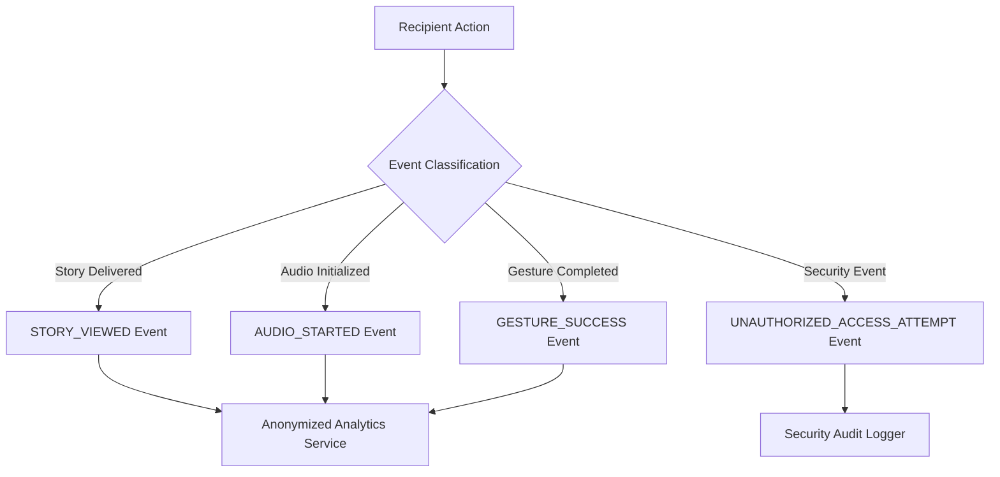

# Feature Specification: Analytics, Audit & Telemetry

---

## 1. Purpose & Privacy Statement

Momenta collects operational metrics to provide senders with read notifications and track technical system health. **Momenta strictly adheres to a zero-tracking privacy policy**: No personal identity profiles are constructed for recipients, and zero third-party advertising tracking scripts (Facebook Pixel, Google Tag Manager) are included in the story delivery payload.

---

## 2. Event Types & Data Schemas



### Telemetry Payload Contract

```typescript
export interface TelemetryEventPayload {
  eventId: string;
  storyToken: string;
  eventType: 'MANIFEST_FETCHED' | 'STORY_STARTED' | 'ACT_COMPLETED' | 'GESTURE_FINISHED';
  timestampIso: string;
  actIndex?: number;
  durationInActMs?: number;
  deviceCategory: 'MOBILE' | 'DESKTOP' | 'TABLET';
  performanceMetrics?: {
    avgFps: number;
    dropFrameCount: number;
    timeToInteractiveMs: number;
  };
}
```

---

## 3. Real-Time Sender Read Notifications

When a recipient completes a story experience, the system fires an asynchronous event (`STORY_EXPERIENCED`) that triggers an optional email/SMS notification to the sender:

> *"Good news! Your Momenta story 'Ten Golden Years' was just experienced by your recipient."*

---

## 4. Audit Log Retention & Compliance

- **Audit Logs**: Security log table (`audit_logs`) records all administrative actions, draft deletions, billing events, and abuse flags with immutable append-only timestamps.
- **GDPR / CCPA Retention**: Sender analytics aggregated into anonymized daily counts. Raw IP addresses in access logs purged after 30 days.
