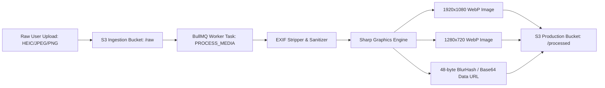

# Feature Specification: Media Processing & Transcoding Pipeline

---

## 1. Purpose & Architecture

The **Media Processing** pipeline asynchronously ingests raw user image uploads and audio files, strips privacy-sensitive EXIF geolocation data, converts proprietary formats (HEIC, RAW, WAV) into optimized streaming web formats (WebP, AVIF, AAC), and generates ultra-compact Base64 preview placeholders.

---

## 2. Technical Requirements & Image Variants

| Image Variant | Dimensions | Format | Quality | Use Case |
| :--- | :--- | :--- | :--- | :--- |
| **Original Encrypted** | Original Resolution | Original (Raw) | 100% | Archival Storage (AES-256 encrypted at rest). |
| **Desktop High-Res** | Max 1920px width | WebP / AVIF | 82% | Desktop WebGL background textures. |
| **Mobile High-Res** | Max 1080px width | WebP | 78% | Standard Mobile story cards. |
| **LQIP Placeholder** | 32px width | WebP / Base64 | 20% | Instant CSS blur-up transition payload. |

---

## 3. Audio Transcoding Rules

- **Input Formats Supported**: MP3, WAV, AAC, M4A, FLAC, OGG (Up to 25MB).
- **Output Target**: AAC in M4A container (128 kbps stereo, 44.1 kHz sampling rate) + MP3 fallback.
- **Waveform Extraction**: Worker computes a 100-point normalized peak array (`[0.0, 0.12, 0.85, ... 0.04]`) stored directly in story manifest to enable client-side visualizer animation without realtime audio decoding overhead.

---

## 4. Security & Sanitization

1. **Malware & File Inspection**: MIME types verified via magic byte inspection (`file-type` binary check), ignoring client file extension headers.
2. **Privacy Enforcement**: All EXIF data (GPS latitude/longitude, camera model, date captured, owner name) stripped before storing transformed assets.
