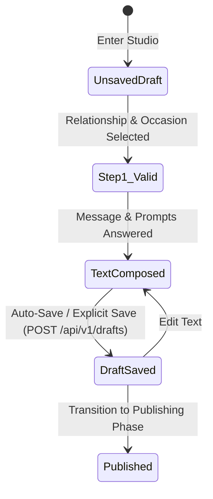

# Feature Specification: Message Creation & Authoring

---

## 1. Purpose & Business Objective

The **Message Creation** module empowers senders to author personalized emotional text, answer contextual reflection prompts, and structure narrative story beats without requiring manual layout skills.

---

## 2. User Story

> **As a** Sender,  
> **I want to** articulate my feelings through guided questions, memory prompts, and customizable typography beats,  
> **So that** I can convey sincere emotion without visual or design frustration.

---

## 3. Business Rules

- **BR-MC-001**: A draft must specify a valid `relationship_type` (e.g. `PARTNER`, `PARENT`, `SIBLING`, `BEST_FRIEND`) and `occasion_type` (`ANNIVERSARY`, `BIRTHDAY`, `CONDOLENCE`, `APOLOGY`).
- **BR-MC-002**: Message text must be between 10 and 2,500 characters.
- **BR-MC-003**: The sender may create up to 10 distinct narrative text beats (nodes) per story.
- **BR-MC-004**: System automatically strips unescaped HTML/script tags to prevent XSS.

---

## 4. State Machine & Lifecycle



---

## 5. Functional & Non-Functional Requirements

### Functional Requirements
1. **Auto-Save**: The studio automatically saves draft content every 3,000ms of typing inactivity.
2. **Prompts Engine**: Based on the selected relationship and occasion, the system presents 3 contextual reflection prompts (e.g., *"What is a moment with them you'll never forget?"*).
3. **Tone Classifier Sync**: Real-time analysis passes text to the Emotion Engine to update preview background colors dynamically.

### Non-Functional Requirements
- **Latency**: Draft save API response time < 80ms (p95).
- **Resilience**: Local storage mirrors draft state; offline drafts auto-sync upon reconnection.

---

## 6. API & Database Impact

### API Endpoint
`POST /api/v1/stories/drafts`

```json
{
  "relationship": "PARTNER",
  "occasion": "ANNIVERSARY",
  "title": "Ten Golden Years",
  "nodes": [
    {
      "sequenceOrder": 1,
      "type": "INTRO_HEADING",
      "contentText": "To my dearest Elena,"
    },
    {
      "sequenceOrder": 2,
      "type": "MEMORY_BEAT",
      "contentText": "Remember that rainy afternoon in Prague?"
    }
  ]
}
```

### Database Impact
Inserts or updates rows in `stories` and `story_nodes` tables within a single PostgreSQL transaction.

---

## 7. Edge Cases & Failure Scenarios

- **Network Disconnection**: Client stores delta in `IndexedDB`. UI displays a yellow badge: *"Saving locally..."*.
- **Profanity / Harassment Detection**: Text passes through moderation AI (AWS Rekognition / OpenAI Moderation). High-severity flags block publish with `422 Unprocessable Entity` ("Content violates safety guidelines").

---

## 8. Acceptance Criteria

- [x] Sender can select relationship and occasion.
- [x] Text autosaves within 3 seconds of pause.
- [x] Character limits strictly enforced on frontend and backend.
- [x] XSS vectors sanitized upon ingestion.
