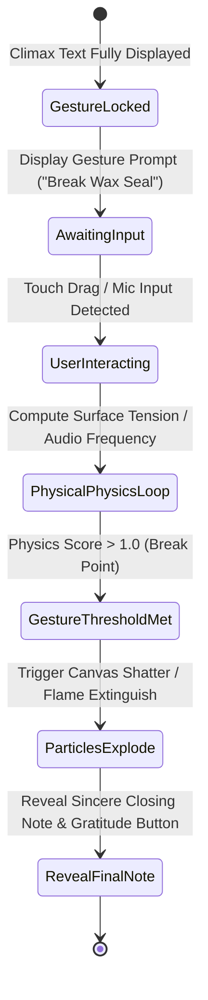

# Feature Specification: Recipient Experience & Gesture Engine

---

## 1. Purpose & Business Objective

The **Recipient Experience** engine delivers an immersive, motion-choreographed web view that executes the published story manifest with audio synchronization and physical touch gestures.

---

## 2. Interactive Gesture State Machine



---

## 3. Gesture Specifications & Mechanics

### 3.1 Wax Seal Shatter (`WAX_SEAL`)
- **Mechanics**: Recipient holds down thumb/finger and swipes across a 3D wax seal emblem.
- **Physics**: Voronoi canvas fragmentation. As touch point velocity exceeds threshold (`500px/s`), seal fractures into 24 dynamic particle rigid bodies with gravity physics.
- **Audio Cue**: Haptic feedback (Vibration API) + high-frequency wax cracking sample audio playback.

### 3.2 Candle Blowout (`CANDLE_BLOW`)
- **Mechanics**: Recipient blows into device microphone OR holds down flame touch target for 3.0 seconds.
- **Audio Processing**: HTML5 `MediaDevices.getUserMedia({ audio: true })`. WebAudio `AnalyserNode` calculates RMS amplitude. If low-frequency noise (100Hz - 400Hz wind turbulence) > -12dB for > 600ms, flame extinguishes.
- **Privacy Fallback**: If mic permission is denied, UI seamlessly falls back to press-and-hold interaction without failing or blocking.

---

## 4. API & Telemetry Event Emission

When the recipient reaches key milestones, non-blocking telemetry events are dispatched to the backend:

`POST /api/v1/events/telemetry`

```json
{
  "storyToken": "x9k2pL1m92a",
  "eventType": "GESTURE_COMPLETED",
  "gestureType": "WAX_SEAL",
  "timeToCompleteMs": 42100,
  "deviceInfo": {
    "viewport": "390x844",
    "touchEnabled": true,
    "gpuRenderer": "Apple GPU"
  }
}
```

---

## 5. Security & One-Time Access Controls

- **Burn-on-Read Option**: Senders can enable *Burn-on-Read*. The first completed gesture invalidates the manifest link on Edge KV. Subsequent opens display a static "Story Completed & Preserved in Memories" notice.
