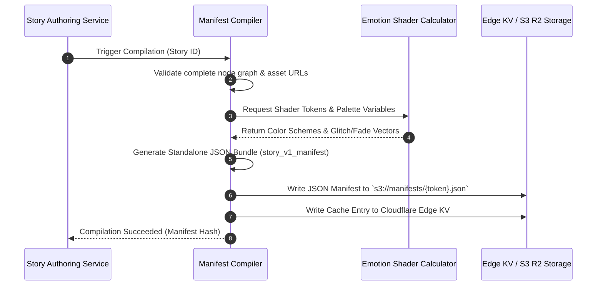

# Feature Specification: Story Generation & Manifest Compilation

---

## 1. Purpose & Business Objective

The **Story Generation** module compiles authored text, emotion parameters, background music stems, and transcoded media into an immutable, high-efficiency static **Story Manifest (JSON)** served via global Edge KV stores.

---

## 2. User Story

> **As the** Momenta System,  
> **I want to** compile complex multi-act story definitions into lightweight, statically optimized JSON manifests,  
> **So that** recipients experience sub-second load times and zero database bottlenecks globally.

---

## 3. Manifest Compilation Architecture



---

## 4. Manifest Schema Definition

```typescript
export interface StoryManifestV1 {
  version: "1.0.0";
  storyId: string;
  accessToken: string;
  createdTimestamp: number;
  metadata: {
    relationship: string;
    occasion: string;
    senderDisplayName: string;
    recipientDisplayName: string;
  };
  theme: {
    presetId: string;
    colors: {
      background: string;
      primaryText: string;
      accentGlow: string;
    };
    typography: {
      headerFont: string;
      bodyFont: string;
    };
    shader: {
      fragmentShaderKey: string;
      speed: number;
      noiseScale: number;
    };
  };
  audio: {
    trackUrl: string;
    fadeInSeconds: number;
    duckOnVoiceover: boolean;
    bpm: number;
  };
  timeline: Array<{
    nodeId: string;
    type: 'HEADING' | 'PARAGRAPH' | 'PHOTO_BEAT' | 'QUOTE';
    text?: string;
    mediaUrl?: string;
    blurDataHeader?: string; // Inline 48-byte Base64 placeholder
    durationMs: number;
    transitionType: 'FADE' | 'SLIDE_PARALLAX' | 'ZOOM_IN';
  }>;
  finalGesture: {
    gestureType: 'WAX_SEAL' | 'CANDLE_BLOW' | 'RIBBON_PULL';
    promptText: string;
    revealedMessageText: string;
  };
}
```

---

## 5. Non-Functional Performance Mandates

- **Manifest Size**: Total JSON manifest payload must be under 35KB compressed (gzip/brotli).
- **Compilation Speed**: Manifest generation must complete within < 300ms from publication trigger.
- **Edge Cache TTL**: Immutable manifests cached infinitely at edge (`Cache-Control: public, max-age=31536000, immutable`). Revocation occurs via explicit Edge KV purge API call upon sender deletion.
