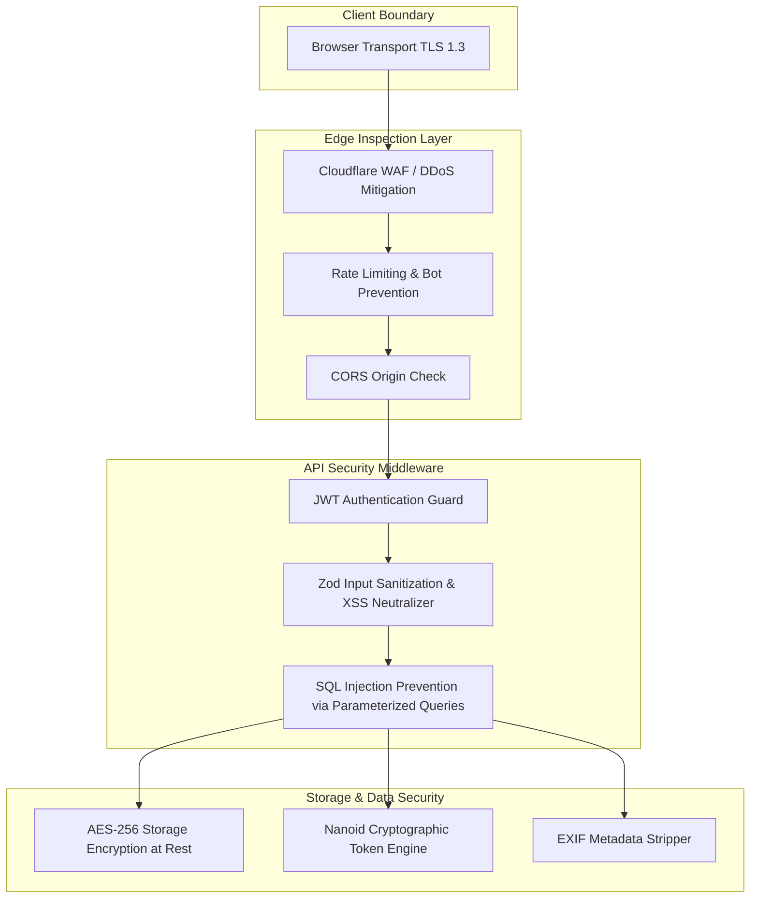

# Momenta — Security, Privacy & Compliance Architecture

---

## 1. Security Architecture Threat Model

Momenta handles personal intimate communications and media. The security architecture enforces a zero-trust model across all layers.

---

## 2. Authentication & Authorization Controls

1. **Password Hashing**: Passwords hashed using `argon2id` (Memory cost: 64MB, Iterations: 3, Parallelism: 4).
2. **Session JWT Tokens**:
   - Short-lived Access Tokens (15-minute expiration) signed via `RS256` asymmetric keys.
   - Long-lived Refresh Tokens (7-day expiration) stored in `HttpOnly`, `SameSite=Strict`, `Secure` cookies with database revocation checks.

---

## 3. OWASP Top 10 Mitigation Matrix

| Vulnerability | Threat Vector | Momenta Automated Mitigation Strategy |
| :--- | :--- | :--- |
| **A01: Broken Access Control** | User attempts to edit another user's story draft. | Row Level Security (RLS) in PostgreSQL + API middleware checking `story.user_id === req.user.id`. |
| **A02: Cryptographic Failures** | Story access tokens brute-forced. | Cryptographically strong 128-bit Nanoids providing $2^{131}$ entropy space. |
| **A03: Injection** | SQL/NoSQL injection via title or node inputs. | All database access forced through Prisma/Kysely typed query builders with parameterized inputs. |
| **A04: Insecure Design** | Recipient audio mic access abused. | Audio processing runs entirely client-side inside WebAudio `AnalyserNode` without recording or uploading raw audio streams. |
| **A07: Identification & Auth** | Credential stuffing attacks. | Cloudflare WAF bot management + IP-based rate limiting + Argon2id work factor throttling. |

---

## 4. Privacy & Compliance

- **GDPR Right to Be Forgotten**: Senders can execute instantaneous account or story deletion. Deletion cascades across database tables, purges edge KV keys, and enqueues permanent S3 file deletion.
- **Child Privacy Protection**: Age verification required upon account creation. AI content moderation screens media for illegal/non-consensual content prior to manifest compilation.
