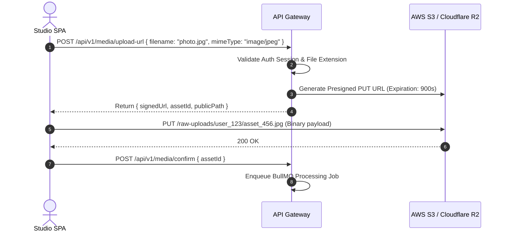

# Momenta — Cloud Storage & Blob Architecture

---

## 1. Bucket Hierarchy & Topology

Momenta utilizes S3-compatible Cloud Storage (AWS S3 or Cloudflare R2) split across isolated environments and lifecycle tiers.

```text
s3://momenta-media-production/
├── raw-uploads/                     # Transient temporary ingestion bucket (7-day auto-purge)
│   └── {user_id}/{draft_id}/
│       └── {raw_file_id}.heic
│
├── processed/                       # Production optimized WebP & AAC files
│   └── stories/
│       └── {story_id}/
│           ├── images/
│           │   ├── {asset_id}_1080p.webp
│           │   └── {asset_id}_720p.webp
│           └── audio/
│               └── {asset_id}_stem.aac
│
└── manifests/                       # Immutable compiled JSON manifests
    └── {access_token}.json
```

---

## 2. Presigned URL Upload Flow

To prevent heavy binary file uploads from passing through API gateway servers, client browsers upload media directly to S3/R2 using pre-signed PUT URLs.



---

## 3. Storage Security & Encryption Controls

1. **Server-Side Encryption**: All objects stored using SSE-S3 (`AES-256` encryption at rest).
2. **Access Control (ACL)**: Production buckets deny public `s3:ListBucket`. Direct reads allowed only via Cloudflare CDN signed request signatures or origin access control (OAC).
3. **CORS Configuration**: Restricts direct upload endpoints to authorized domain origins (`https://momenta.app`, `https://studio.momenta.app`).
