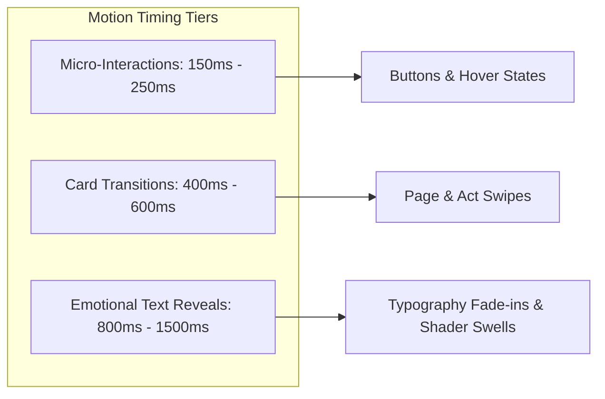

# Momenta — Motion System Architecture & Animation Bible

---

## 1. Motion Design Principles

Animation in Momenta is never decorative filler. It serves as **Emotional Pacing**. All transitions adhere to standard motion parameters inspired by high-end cinema and luxury physical interactions.



---

## 2. Easing Curves & Timing Tokens

| Token Name | Cubic-Bezier Value | Purpose & Motion Character |
| :--- | :--- | :--- |
| `--ease-momenta-out` | `cubic-bezier(0.16, 1, 0.3, 1)` | **Emphasized Deceleration**: Ultra-smooth entrance for text and photos. |
| `--ease-momenta-in-out` | `cubic-bezier(0.65, 0, 0.35, 1)` | **Symmetric Flow**: Used for act transitions and background shader morphs. |
| `--ease-spring-bounce` | `cubic-bezier(0.34, 1.56, 0.64, 1)` | **Tactile Feedback**: Subtle spring physics on final gesture triggers. |

---

## 3. Standard Animation Keyframe Registry

### 3.1 Text Reveal Fade & Glow

```css
@keyframes momentaTextGlowReveal {
  0% {
    opacity: 0;
    transform: translateY(24px) scale(0.98);
    filter: blur(12px);
  }
  60% {
    opacity: 0.8;
    filter: blur(2px);
  }
  100% {
    opacity: 1;
    transform: translateY(0) scale(1);
    filter: blur(0);
  }
}

.animate-text-reveal {
  animation: momentaTextGlowReveal 1200ms var(--ease-momenta-out) forwards;
}
```

### 3.2 Parallax Card Shift Physics

```typescript
// Framer Motion Variant Definition for Story Nodes
export const storyNodeVariants = {
  hidden: {
    opacity: 0,
    y: 40,
    scale: 0.95,
    filter: "blur(8px)",
  },
  visible: {
    opacity: 1,
    y: 0,
    scale: 1,
    filter: "blur(0px)",
    transition: {
      duration: 0.8,
      ease: [0.16, 1, 0.3, 1],
    },
  },
  exit: {
    opacity: 0,
    y: -30,
    scale: 0.98,
    filter: "blur(6px)",
    transition: {
      duration: 0.5,
      ease: [0.65, 0, 0.35, 1],
    },
  },
};
```

---

## 4. Hardware Acceleration & Frame Budget

1. **GPU Layer Promotion**: All animated elements use `transform: translate3d(...)` or `will-change: transform, opacity;` to enforce zero CPU layout reflows (`reflow` count = 0 during playback).
2. **Dynamic Resolution Scaling**: If `window.requestAnimationFrame` measures 3 consecutive frames below 45 FPS, the WebGL canvas pixel ratio drops dynamically from `2.0` (Retina) to `1.0` (Native), preserving frame pacing.
