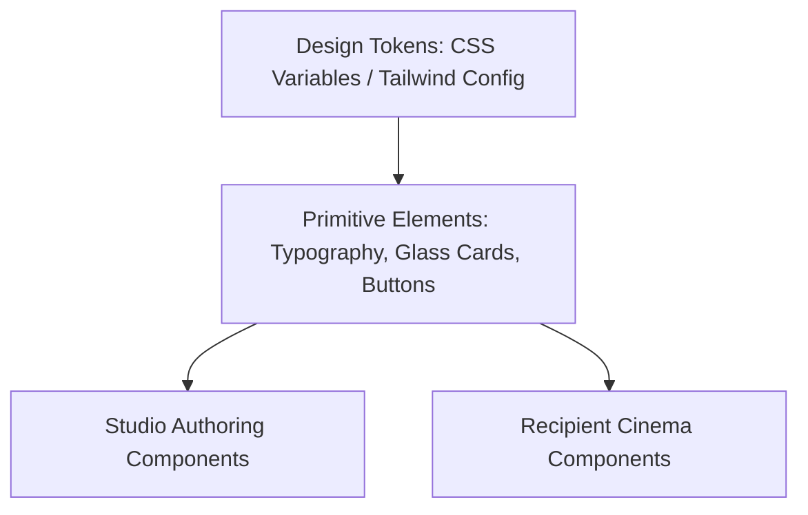

# Momenta — Design System & Visual Tokens

---

## 1. Design System Philosophy

The Momenta Design System is constructed for high dynamic range emotional expression. It enforces strict dark-mode-first aesthetic tokens, fluid responsive typography, and glassmorphic translucent surfaces.



---

## 2. Color Tokens & Theme Systems

### Core Neutral & Dark Mode Foundation
```css
:root {
  /* Surface Layers */
  --momenta-bg-base: #090a0f;
  --momenta-bg-surface: #121520;
  --momenta-bg-glass: rgba(18, 21, 32, 0.65);

  /* Primary Violet Accent */
  --momenta-violet-500: #8b5cf6;
  --momenta-violet-400: #a78bfa;
  --momenta-violet-600: #7c3aed;

  /* Rose & Warmth Accents */
  --momenta-rose-500: #f43f5e;
  --momenta-amber-500: #f59e0b;

  /* Typography Colors */
  --momenta-text-primary: #f8fafc;
  --momenta-text-secondary: #94a3b8;
  --momenta-text-muted: #64748b;

  /* Borders & Glass Dividers */
  --momenta-border-glass: rgba(255, 255, 255, 0.08);
  --momenta-blur-glass: blur(16px);
}
```

---

## 3. Typography Scale & Pairings

| Emotion Tone | Header Font Family | Body Font Family | Character Spacing |
| :--- | :--- | :--- | :--- |
| **Romantic / Nostalgic** | *Playfair Display* / *Cormorant Garamond* | *Inter* / *Plus Jakarta Sans* | `-0.02em` |
| **Warm / Heartfelt** | *Lora* / *Merriweather* | *Outfit* / *Roboto* | `0.00em` |
| **Cinematic / Modern** | *Cinzel* / *Syne* | *Inter* | `+0.04em` |
| **Playful / Joyful** | *Plus Jakarta Sans (Bold)* | *Outfit* | `0.00em` |

```css
/* Responsive Fluid Typography Rules */
h1.momenta-hero-text {
  font-family: 'Playfair Display', Georgia, serif;
  font-size: clamp(2.25rem, 5vw + 1rem, 4.5rem);
  line-height: 1.15;
  letter-spacing: -0.025em;
  background: linear-gradient(135deg, #ffffff 0%, #cbd5e1 100%);
  -webkit-background-clip: text;
  -webkit-text-fill-color: transparent;
}
```

---

## 4. UI Component Library Standards

- **Glassmorphic Card (`.momenta-card`)**:
  ```css
  .momenta-card {
    background: var(--momenta-bg-glass);
    backdrop-filter: var(--momenta-blur-glass);
    -webkit-backdrop-filter: var(--momenta-blur-glass);
    border: 1px solid var(--momenta-border-glass);
    border-radius: 16px;
    box-shadow: 0 20px 40px -15px rgba(0, 0, 0, 0.5);
  }
  ```
- **Pulsing Action Trigger (`.momenta-pulse-button`)**: Includes a CSS keyframe aura animation prompting the user to tap and begin WebAudio playback.
