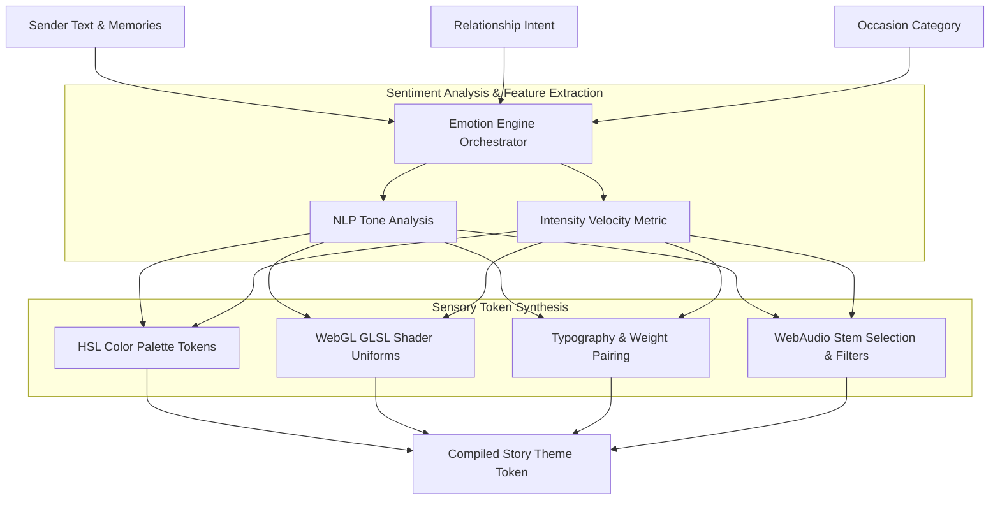
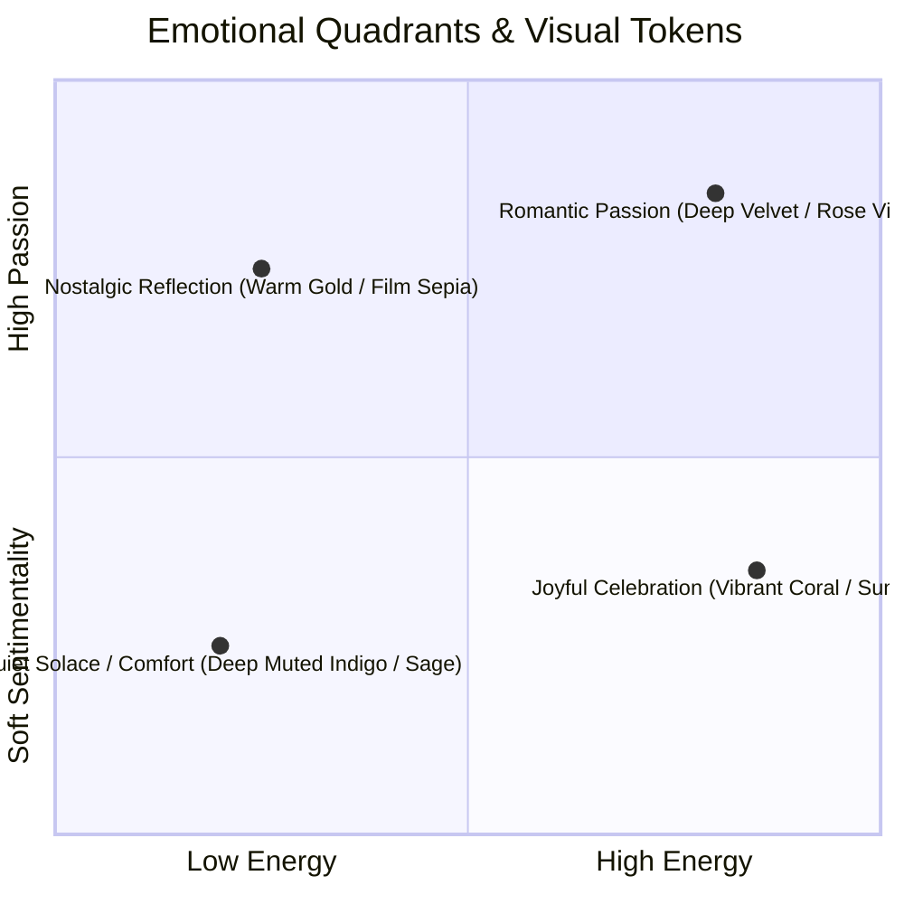

# Momenta — Emotion Engine Architecture & Sentiment Mapping

---

## 1. Emotion Engine Philosophy

The **Emotion Engine** is Momenta’s core differentiation system. It transforms raw text, relationship intent, and occasion choices into a cohesive sensory landscape consisting of dynamic WebGL GLSL shaders, HSL color palettes, typography weights, and WebAudio ambient stems.



---

## 2. Emotional Tone Taxonomy & Palettes

The system categorizes emotional intent into 5 core **Emotional Quadrants**:



### Palette Token Definitions

| Emotional Preset | Primary Background | Text Main | Accent Glow | GLSL Shader Preset |
| :--- | :--- | :--- | :--- | :--- |
| **NOSTALGIC_WARMTH** | `#0f0d0b` (Charcoal Gold) | `#f5efe6` | `#d97706` | `SepiaGrainFlow.frag` |
| **DEEP_ROMANCE** | `#120914` (Midnight Velvet) | `#fdf4ff` | `#c084fc` | `EtherealAuraMesh.frag` |
| **SOLACE_COMFORT** | `#0a0e14` (Abyssal Blue) | `#f1f5f9` | `#38bdf8` | `GentleWaterRipples.frag` |
| **JOYFUL_BURST** | `#180b0e` (Dark Crimson) | `#fff1f2` | `#fb7185` | `ParticleSparkleSwarm.frag` |
| **PLAYFUL_LIGHT** | `#0f172a` (Slate Navy) | `#f8fafc` | `#34d399` | `GeometricBokehWave.frag` |

---

## 3. WebGL GLSL Shader Integration Specification

The Emotion Engine injects sentiment-calculated uniforms into WebGL fragment shaders in real time during the story render loop.

```glsl
// EtherealAuraMesh.frag - Dynamic Emotion Fragment Shader
precision mediump float;

uniform vec2 u_resolution;
uniform float u_time;
uniform float u_emotion_intensity; // Normalized 0.0 - 1.0 from Sentiment Analysis
uniform vec3 u_color_primary;
uniform vec3 u_color_accent;

float noise(vec2 st) {
    return fract(sin(dot(st.xy, vec2(12.9898,78.233))) * 43758.5453123);
}

void main() {
    vec2 st = gl_FragCoord.xy / u_resolution.xy;
    st.x *= u_resolution.x / u_resolution.y;

    vec2 pos = st * (2.0 + u_emotion_intensity * 1.5);
    float n = noise(pos + vec2(u_time * 0.1, u_time * 0.15));

    vec3 color = mix(u_color_primary, u_color_accent, sin(u_time * 0.5 + n * 6.28) * 0.5 + 0.5);
    float glow = smoothstep(0.2, 0.8, distance(st, vec2(0.5)));

    gl_FragColor = vec4(color * (1.0 - glow * 0.5), 1.0);
}
```

---

## 4. Emotional State Curves over Time

```mermaid
gantt
    title Dynamic Audio-Visual Intensity Curve Across Story Acts
    dateFormat SS
    axisFormat %S sec

    section Act I: Hook & Atmosphere
    Atmospheric Low Volume & Soft Blur :active, 00, 08
    section Act II: Narrative Memory Beats
    Gradual Color Warmth & Crossfade Stems :active, 08, 20
    section Act III: Emotional Climax
    Full Typography Glow & Audio Swell :active, 20, 28
    section Act IV: Final Gesture & Resolution
    Acoustic Resolution & Soft Ambient Glow :active, 28, 35
```

1. **Act I (Intro)**: Low opacity typography, low-pass filter on WebAudio track (cutoff frequency 400Hz).
2. **Act II (Build)**: Low-pass filter frequency sweeps upward to 12,000Hz as memory photos scroll.
3. **Act III (Climax)**: WebGL shader noise amplitude peaks; typography scales to full contrast.
4. **Act IV (Resolution)**: Audio drops by -6dB; canvas transitions to static particle ambient rest state.
