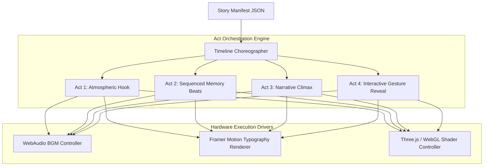
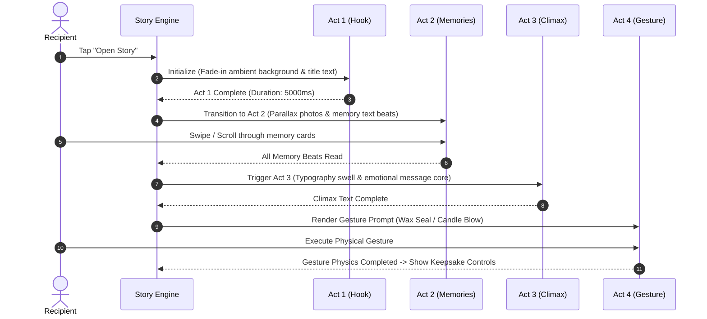

# Momenta — Story Engine Architecture & Narrative Choreography

---

## 1. Story Engine Architecture

The **Story Engine** is the runtime choreography system responsible for assembling discrete story nodes (headings, memory text, photo beats, quotes) into a fluid, multi-act narrative sequence.



---

## 2. Multi-Act Narrative Structure Rules



---

## 3. Node Transition & Parallax Specifications

```typescript
export interface NodeChoreographySpec {
  nodeId: string;
  actIndex: 1 | 2 | 3 | 4;
  enterAnimation: {
    type: 'FADE_UP' | 'ZOOM_SLIGHT' | 'BLUR_REVEAL';
    durationMs: number;
    easingCurve: [number, number, number, number]; // Cubic Bezier e.g. [0.16, 1, 0.3, 1]
  };
  exitAnimation: {
    type: 'FADE_OUT' | 'PARALLAX_SLIDE_LEFT';
    durationMs: number;
  };
  audioCue: {
    duckBgmVolume: number; // e.g. 0.3 (duck to 30% volume)
    triggerSFX?: string;
  };
}
```

---

## 4. Adaptive Screen & Viewport Response

- **Mobile Viewport (< 768px)**: Vertical single-column swipe sequence. Touch swipe velocity (`deltaY`) mapped directly to timeline progress.
- **Desktop Viewport (>= 768px)**: Horizontal multi-layered card parallax with subtle 3D tilt tracking cursor motion (`perspective: 1000px`, `rotateX/Y` up to $\pm 8^\circ$).
