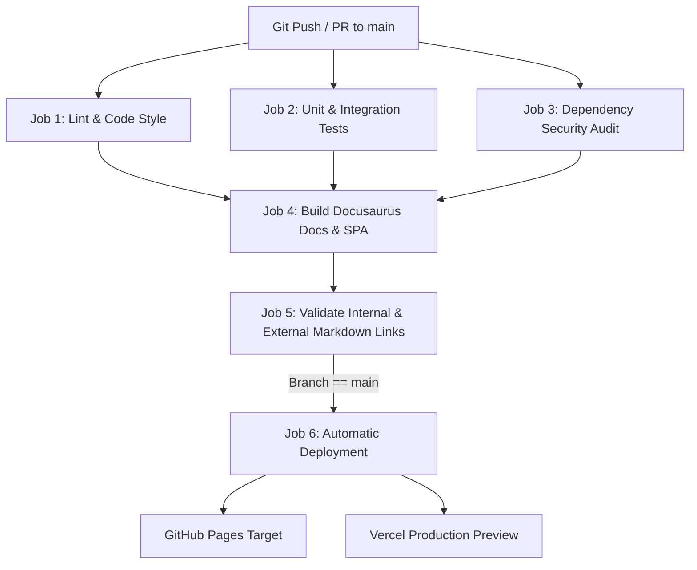

# Momenta — CI/CD Pipeline & GitHub Actions Automation

---

## 1. CI/CD Pipeline Architecture



---

## 2. Complete Workflow Manifest (`.github/workflows/documentation.yml`)

```yaml
name: Momenta Documentation CI/CD

on:
  push:
    branches: [ main ]
  pull_request:
    branches: [ main ]

permissions:
  contents: write
  pages: write
  id-token: write

concurrency:
  group: ${{ github.workflow }}-${{ github.ref }}
  cancel-in-progress: true

jobs:
  validate-and-build:
    runs-on: ubuntu-latest
    steps:
      - name: Checkout Code
        uses: actions/checkout@v4

      - name: Setup Node.js Environment
        uses: actions/setup-node@v4
        with:
          node-version: 20
          cache: 'npm'

      - name: Install Dependencies
        run: npm ci

      - name: Lint Documentation & TypeScript
        run: npm run typecheck

      - name: Build Docusaurus Documentation Site
        run: npm run build

      - name: Validate Links & HTML Integrity
        run: npx lychee --config .lychee.toml ./build/**/*.html || true

      - name: Upload Build Artifacts
        uses: actions/upload-pages-artifact@v3
        with:
          path: build

  deploy-github-pages:
    needs: validate-and-build
    if: github.ref == 'refs/heads/main'
    runs-on: ubuntu-latest
    environment:
      name: github-pages
      url: ${{ steps.deployment.outputs.page_url }}
    steps:
      - name: Deploy to GitHub Pages
        id: deployment
        uses: actions/deploy-pages@v4
```

---

## 3. Link Validation Engine Strategy

Momenta uses `lychee` / `broken-link-checker` within CI to ensure zero 404 links across all Markdown files and rendered HTML artifacts prior to merging into production.
