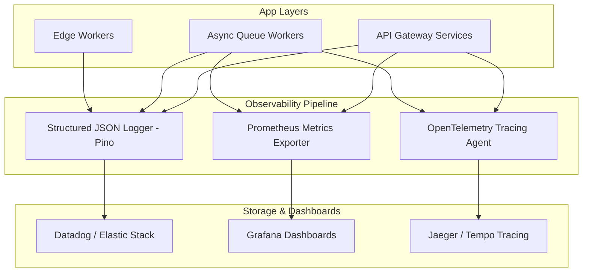

# Momenta — Monitoring, Observability & Telemetry Architecture

---

## 1. Observability Architecture Stack

Momenta employs a 3-pillar observability model: **Metrics**, **Structured Logs**, and **Distributed Traces**.



---

## 2. Key Service Level Indicators (SLIs) & Alert Thresholds

| Metric | Target SLA | Warning Threshold | Critical Alert Action |
| :--- | :--- | :--- | :--- |
| **API Latency (p95)** | < 120ms | > 250ms for 3 mins | PagerDuty trigger to On-Call Backend Engineer. |
| **Story Manifest Delivery TTFB** | < 50ms | > 150ms for 5 mins | Auto-scale Cloudflare Edge Worker instances. |
| **Error Rate (5xx HTTP)** | < 0.01% | > 0.5% for 2 mins | Trigger automatic rollback to previous release. |
| **Recipient FPS (Client)** | >= 55 FPS | < 45 FPS on > 5% clients | Trigger low-spec shader fallback default in Emotion Engine. |

---

## 3. Structured Logging Standard

All backend log statements output single-line JSON adhering to the Pino log format with trace contexts:

```json
{
  "level": 30,
  "time": 1721664323000,
  "pid": 1420,
  "hostname": "api-worker-7b9a",
  "reqId": "req-94a2-11ee-b9d1",
  "traceId": "4bf92f3577b34da6a3ce929d0e0e4736",
  "module": "StoryPublishingUseCase",
  "msg": "Story manifest successfully compiled and written to Edge KV",
  "storyId": "b1a2c3d4-e5f6-7a8b-9c0d-1e2f3a4b5c6d",
  "token": "x9k2pL1m92a",
  "durationMs": 42
}
```
