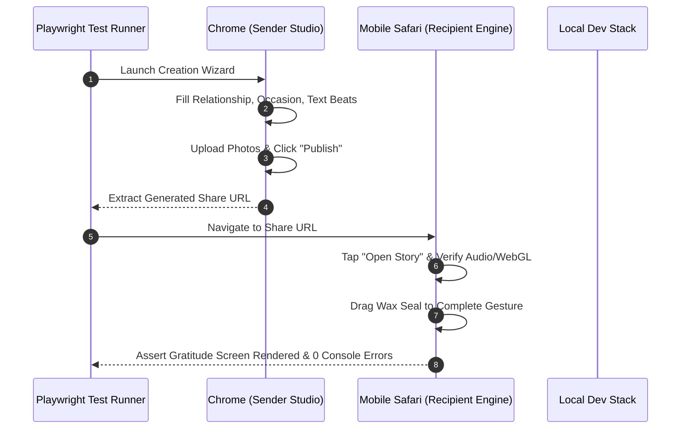

# Momenta — End-to-End (E2E) & Visual Regression Testing

---

## 1. Playwright E2E Architecture

End-to-End tests simulate full browser flows across real desktop and mobile viewports using **Playwright**.



---

## 2. Playwright Test Script (`StoryFlow.e2e.ts`)

```typescript
import { test, expect } from '@playwright/test';

test.describe('Momenta End-to-End Story Lifecycle', () => {
  test('Sender creates story and Recipient executes Wax Seal gesture', async ({ page, context }) => {
    // 1. Authoring Flow
    await page.goto('http://localhost:3000/studio');
    await page.click('text=Start Creating');
    await page.selectOption('select[name="relationship"]', 'PARTNER');
    await page.selectOption('select[name="occasion"]', 'ANNIVERSARY');
    await page.fill('textarea[name="message"]', 'Happy Anniversary! A decade of wonderful memories.');
    await page.click('button:has-text("Lock & Send")');

    // Extract Share URL
    const shareUrlInput = page.locator('input[readonly]');
    await expect(shareUrlInput).toBeVisible();
    const shareUrl = await shareUrlInput.inputValue();

    // 2. Recipient Flow on Mobile Viewport
    const mobileContext = await context.browser()?.newContext({
      viewport: { width: 390, height: 844 },
      userAgent: 'Mozilla/5.0 (iPhone; CPU iPhone OS 17_0 like Mac OS X)',
    });
    const recipientPage = await mobileContext!.newPage();
    await recipientPage.goto(shareUrl);

    // Verify Splash Screen
    await expect(recipientPage.locator('text=Open Momenta')).toBeVisible();
    await recipientPage.click('text=Open Momenta');

    // Complete Gesture
    const waxSeal = recipientPage.locator('[data-testid="wax-seal-target"]');
    await expect(waxSeal).toBeVisible();
    await waxSeal.dragTo(recipientPage.locator('[data-testid="gesture-drop-zone"]'));

    // Assert Keepsake View
    await expect(recipientPage.locator('text=Preserved in Memories')).toBeVisible();
  });
});
```

---

## 3. Visual Regression Testing with Percy / Playwright Screenshots

Momenta captures full-page visual snapshots across 3 viewports (`390px`, `768px`, `1440px`) to prevent visual drift or layout breaking during CSS refactoring:

```typescript
await expect(page).toHaveScreenshot('story-climax-act.png', {
  maxDiffPixelRatio: 0.01,
});
```
