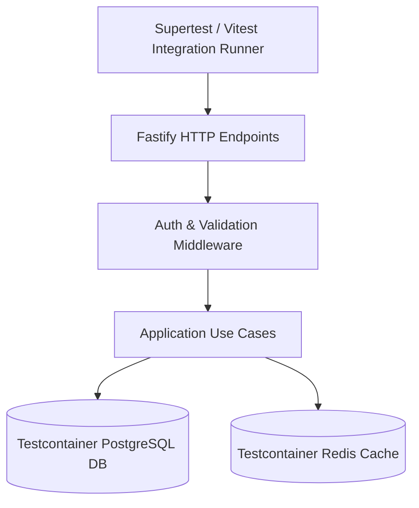

# Momenta — Integration Testing Strategy & API Suites

---

## 1. Integration Scope & Architecture

Integration tests verify component boundaries, database repositories (using testcontainers / real PostgreSQL instances), Supertest REST API requests, and BullMQ worker queue dispatchers.



---

## 2. API Integration Test Spec (`PublishStory.integration.spec.ts`)

```typescript
import { describe, it, expect, beforeAll, afterAll } from 'vitest';
import request from 'supertest';
import { buildTestApp } from '../helpers/testApp';

describe('POST /api/v1/stories/:id/publish Integration Suite', () => {
  let app: any;
  let authToken: string;
  let draftId: string;

  beforeAll(async () => {
    app = await buildTestApp();
    const loginRes = await request(app.server)
      .post('/api/v1/auth/login')
      .send({ email: 'test@momenta.app', password: 'Password123!' });
    authToken = loginRes.body.token;

    const draftRes = await request(app.server)
      .post('/api/v1/stories/draft')
      .set('Authorization', `Bearer ${authToken}`)
      .send({
        title: 'Integration Test Story',
        relationship: 'PARTNER',
        occasion: 'ANNIVERSARY',
      });
    draftId = draftRes.body.data.draftId;
  });

  it('should compile and publish the story draft, returning a valid share token', async () => {
    const response = await request(app.server)
      .post(`/api/v1/stories/${draftId}/publish`)
      .set('Authorization', `Bearer ${authToken}`);

    expect(response.status).toBe(200);
    expect(response.body.success).toBe(true);
    expect(response.body.data.accessToken).toHaveLength(16);
    expect(response.body.data.shareUrl).toContain('/s/');
  });
});
```

---

## 3. Database Cleanup Strategy

Every integration test runs inside an isolated transaction roll-back block or uses `truncate tables` teardowns between test runs to guarantee deterministic execution.
