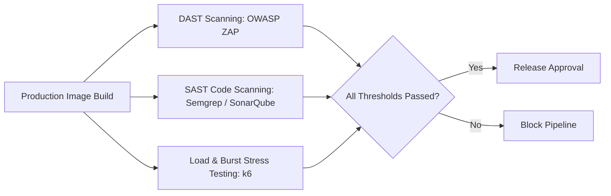

# Momenta — Security, Penetration & Load Testing

---

## 1. Automated Security Penetration Testing

Momenta integrates automated vulnerability and penetration testing into every release build using **OWASP ZAP**, **Snyk**, and **k6**.



---

## 2. Load & Burst Stress Test Suite (`load-test-k6.js`)

Momenta simulates viral spikes (e.g. Valentine's Day traffic bursts) using Grafana `k6` to verify Edge KV delivery performance:

```javascript
import http from 'k6/http';
import { check, sleep } from 'k6';

export const options = {
  stages: [
    { duration: '30s', target: 500 },  // Ramp up to 500 VUs
    { duration: '1m',  target: 5000 }, // Spike to 5,000 concurrent recipients
    { duration: '30s', target: 0 },    // Cool down
  ],
  thresholds: {
    http_req_duration: ['p(95)<150'], // 95% of requests must complete under 150ms
    http_req_failed: ['rate<0.001'],  // Error rate less than 0.1%
  },
};

export default function () {
  const token = 'x9k2pL1m92a';
  const res = http.get(`https://momenta.app/api/v1/delivery/${token}`);
  check(res, {
    'status is 200': (r) => r.status === 200,
    'manifest has nodes': (r) => r.json().timeline.length > 0,
  });
  sleep(1);
}
```

---

## 3. Dependency Vulnerability Audits

- `npm audit --audit-level=high` executed in CI to block vulnerable packages.
- Daily Snyk container vulnerability scanning of `Dockerfile` layers.
