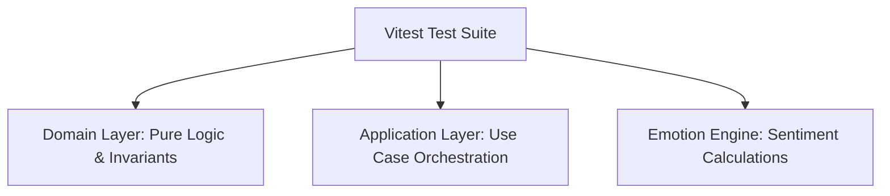

# Momenta — Unit Testing Strategy & Test Suites

---

## 1. Testing Philosophy & Coverage Target

Momenta enforces a strict Test-Driven Development (TDD) approach for domain logic, business rules, and state machines.

- **Coverage Goal**: 100% statement and branch coverage on Domain Entities and Value Objects; > 90% coverage on Application Use Cases.
- **Test Runner**: Vitest for ultra-fast, ESM-native TypeScript execution.



---

## 2. Sample Domain Unit Test Suite (`Story.spec.ts`)

```typescript
import { describe, it, expect } from 'vitest';
import { Story } from '../domain/Story';
import { LinkToken } from '../domain/LinkToken';
import { MessageContent } from '../domain/MessageContent';

describe('Story Aggregate Root', () => {
  it('should initialize a valid draft story with default state', () => {
    const story = Story.createDraft({
      senderId: 'user-123',
      relationship: 'PARTNER',
      occasion: 'ANNIVERSARY',
      title: 'Ten Golden Years',
    });

    expect(story.status).toBe('DRAFT');
    expect(story.nodes).toHaveLength(0);
    expect(story.accessToken).toBeDefined();
  });

  it('should throw an invariant error if message content exceeds 2500 characters', () => {
    const longText = 'a'.repeat(2501);
    expect(() => new MessageContent(longText)).toThrowError(
      'Message content exceeds maximum allowed length'
    );
  });

  it('should transition status from DRAFT to PUBLISHED upon publication', async () => {
    const story = Story.createDraft({
      senderId: 'user-123',
      relationship: 'PARTNER',
      occasion: 'ANNIVERSARY',
      title: 'Valid Story',
    });

    story.addNode({ sequenceOrder: 1, nodeType: 'INTRO_HEADING', contentText: 'Hello' });
    story.addNode({ sequenceOrder: 2, nodeType: 'MEMORY_BEAT', contentText: 'World' });

    story.publish();
    expect(story.status).toBe('PUBLISHED');
    expect(story.publishedAt).toBeInstanceOf(Date);
  });
});
```

---

## 3. Test Execution & CLI Commands

```bash
# Run all unit tests in watch mode
npm run test:unit

# Run unit tests with coverage report
npm run test:unit -- --coverage
```
