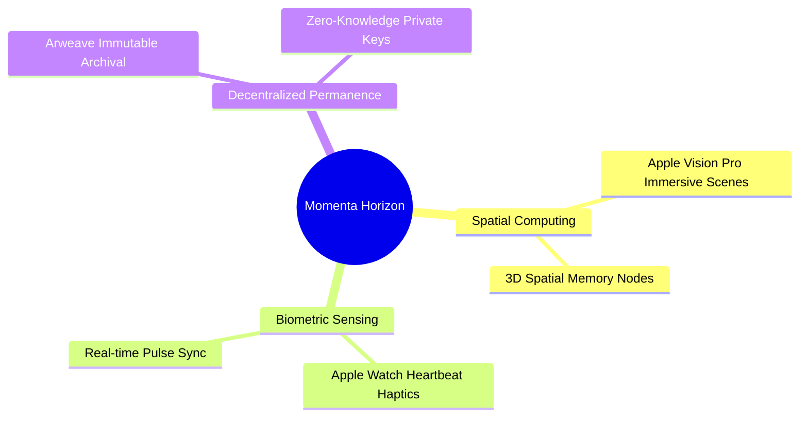

# Future Ideas & Blue-Sky Explorations

---

## 1. Long-Term Innovation Horizon

---

## 2. Exploratory Concepts

1. **Biometric Haptic Sync**:
   - The sender records their heartbeat via Apple Watch / Android Wear. The recipient’s mobile device vibrates (via Haptic Engine) in exact sync with the sender’s recorded pulse during the story climax.
2. **Spatial Computing (VisionOS & WebXR)**:
   - Recipient puts on a VR/AR headset to view memory photos floating in 3D spatial orbit around their room with spatialized WebAudio positional sound.
3. **Decentralized Archival Vaults**:
   - Optional permanent archival of milestone stories to decentralized storage networks (Arweave / IPFS) with client-side Zero-Knowledge encryption keys held exclusively by the recipient.
