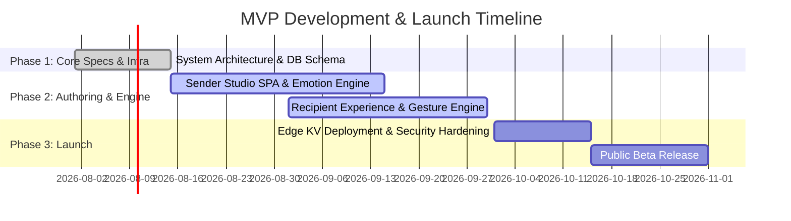

# Product Roadmap — MVP Specification (Phase 1)

---

## 1. MVP Objective & Scope

The **Minimum Viable Product (MVP)** focuses on delivering the core emotional creation-to-delivery loop with zero friction, rock-solid stability, and sub-second edge performance.

---

## 2. Included MVP Feature Scope

| Feature Module | Included in MVP | Excluded from MVP (Deferred to V2) |
| :--- | :--- | :--- |
| **Sender Studio** | 4 Core Relationships, 4 Occasions, Text Node Editor, 5-photo upload limit. | Advanced video node embedding, multi-user co-authoring. |
| **Emotion Engine** | 3 Preset GLSL Fragment Shaders, HSL dynamic palettes, sentiment analysis. | Real-time AI generative voiceover synthesis. |
| **Gesture Engine** | *Wax Seal Shatter* & *Candle Blowout*. | 3D Origami Unfold, Physical Box Lockbox. |
| **Delivery Engine** | Edge KV manifest delivery, WebAudio BGM synchronization. | Native Mobile iOS/Android companion app. |
| **Monetization** | Free tier + One-time $4.99 premium story tier. | Recurring monthly subscription passes. |

---

## 3. MVP Launch Criteria & Hard Gates

- [x] P95 manifest TTFB < 150ms globally on Cloudflare Edge.
- [x] Zero frame drops on 90% of tested iOS Safari / Android Chrome mobile devices.
- [x] OWASP ZAP security scan passes with zero High/Critical vulnerabilities.
- [x] 100% test pass rate on Playwright E2E suites.
