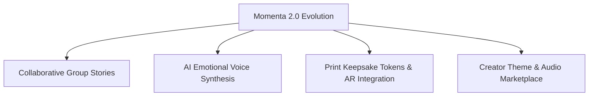

# Product Roadmap — Version 2.0 Features

---

## 1. V2 Strategic Pillars

Version 2.0 expands Momenta from single-sender micro-experiences into **Collaborative Group Narratives** and **AI-Assisted Emotion Choreography**.

---

## 2. Key V2 Feature Specifications

### 2.1 Group Story Authoring (Co-Authoring)
- **Concept**: Multiple family members or friends contribute memory beats and photos to a single story for a shared recipient (e.g. 50th Birthday or Retirement).
- **Architecture**: Real-time Operational Transformation (OT) or CRDTs (`Yjs`) over WebSockets allowing parallel node editing with conflict-free resolution.

### 2.2 AI Generative Voiceover & Narration
- **Concept**: Integrates ElevenLabs / OpenAI Audio API to synthesize natural, emotionally expressive voice narration of text nodes matched to selected ambient background music stems.

### 2.3 Physical Keepsake Token & AR Reveal
- **Concept**: Recipient can order a physical metallic NFC coin or embossed wooden card with an engraved QR code. Scanning the card opens an Augmented Reality (AR) portal rendering the WebGL experience overlaying physical space.
