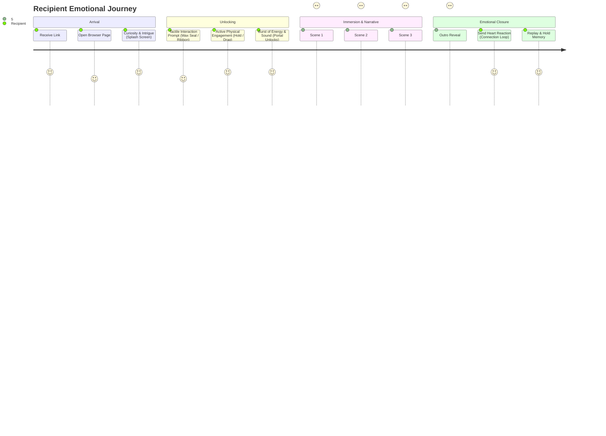

# MOMENTA — CINEMATIC RECIPIENT EXPERIENCE ARCHITECTURE SPECIFICATION

> **"Your feelings, on a page."**  
> *Architectural Specification & Experience Blueprint for the Momenta Recipient Engine.*

---

## 1. Executive Summary & Vision

Momenta transforms digital messages from static web text into **immersive, interactive short films running natively in the recipient's web browser**. When a recipient opens a Momenta link (`/experience/[token]`), the browser interface recedes, yielding to a handcrafted personal memory world customized by relationship type, harmonic soundscapes, WebGL shaders, kinetic typography, and tactile physical gestures.

---

## 2. Complete User & Emotional Journey Map

---

## 3. Lifecycle State Machine & Transition Architecture

The experience execution lifecycle is governed by a strict, deterministic state machine:

```mermaid
stateDiagram-v2
    [*] --> LOADING: Fetch Manifest & Preload Assets
    LOADING --> UNOPENED: Manifest Validated & Audio Initialized
    LOADING --> ERROR: Invalid Token or Load Failure
    
    UNOPENED --> UNLOCKING: Gesture Triggered (Touch / Pointer Down)
    UNLOCKING --> UNOPENED: Gesture Cancelled / Release
    UNLOCKING --> PLAYING: Gesture Complete (Threshold Met)
    
    PLAYING --> PAUSED: User Intercept / Manual Pause
    PAUSED --> PLAYING: Resume Playback
    
    PLAYING --> COMPLETED: Final Scene Elapsed
    COMPLETED --> PLAYING: Replay Initiated
```

### State Definitions
- **`LOADING`**: Fetches manifest by `token`, initializes WebGL background context, pre-renders soundscape oscillators.
- **`UNOPENED`**: Displays splash screen with customized relationship prelude and tactile gesture prompt (`Wax Seal`, `Satin Ribbon`, `Memory Candle`, etc.).
- **`UNLOCKING`**: Tracks real-time physics progress ($0 \to 100\%$) during tactile interaction with real-time acoustic pitch modulation.
- **`PLAYING`**: Auto-advancing cinematic scene timeline with 3D parallax tilt, dynamic kinetic typography, and audio soundscape.
- **`PAUSED`**: Halts scene countdown timer, freezes camera movement, dims screen slightly.
- **`COMPLETED`**: Displays memory keepsake summary card, emotional reaction button ("Send Warmth"), and replay trigger.
- **`ERROR`**: Graceful fallback UI with helpful recovery options.

---

## 4. Relationship Adaptation System

Momenta tailors visual atmosphere, sound frequency, and unlock gesture based on the relationship archetype established between sender and recipient:

| Relationship Archetype | Primary Palette | WebGL Shader | Unlock Gesture | Harmonic Tuning Key |
|---|---|---|---|---|
| **`ROMANTIC_SOULMATE`** | Deep Crimson, Velvet Rose & Warm Gold | `Aurora` / `RoseGoldEmber` | **`SATIN_RIBBON`** | A4 (440 Hz / Warm Major Seventh) |
| **`BEST_FRIEND_FOREVER`** | Electric Amber, Sunshine Gold & Bronze | `GoldDust` | **`WAX_SEAL`** | D4 (293.66 Hz / Bright Pentatonic) |
| **`DEEP_FAMILIAL`** | Emerald Evergreen, Jade & Copper | `Embers` | **`HERITAGE_LOCKET`** | G3 (196.00 Hz / Deep Grounded Octaves) |
| **`NOSTALGIC_CHILDHOOD`** | Midnight Blue, Starlight & Soft Pearl | `Starlight` | **`MEMORY_CANDLE`** | E4 (329.63 Hz / Lydian Dreamscape) |
| **`MENTOR_INSPIRATION`** | Sapphire Indigo, Azure & Celestial Silver | `Watercolor` | **`UNFOLD_PARCHMENT`** | C4 (261.63 Hz / Clean Fundamental Harmonic) |

---

## 5. Interaction & Camera Movement Plan

1. **Camera Parallax**:
   - Cursor / Motion Vector $(x, y) \in [-1, 1]$ mapped to card 3D tilt:
     $$\text{rotateX} = -y \times 12^\circ, \quad \text{rotateY} = x \times 12^\circ$$
   - Smooth dampening via GSAP `quickTo` with factor $\tau = 0.15$.
2. **Kinetic Typography Stagger**:
   - Each word fades in with $y$-translation from $+15\text{px} \to 0\text{px}$ and opacity $0 \to 1$.
   - Inter-word delay: $140\text{ms}$ with extended $300\text{ms}$ delay for punctuation (`.`, `,`, `!`, `?`).
3. **Gesture Physics**:
   - **`WaxSeal`**: 1.2 second continuous press with radial pressure ring expansion, vibration haptics (where available), and golden wax fracture animation.
   - **`SatinRibbon`**: Horizontal drag vector exceeding 80% screen width to unbind ribbon node.
   - **`MemoryCandle`**: Hold touch over wick for 1.0s to light flame with expanding radial light flare.

---

## 6. Technical Implementation Strategy & Standards

- **Core Framework**: React 18 + Next.js App Router / Vite client integration.
- **State Engine**: React Context + Custom Hook (`useCinematicExperience`) with strict state transitions.
- **Rendering & VFX**: WebGL fragment shaders via `@vfx-js/core` and HTML5 2D Canvas fallback.
- **Animation**: GSAP 3 timeline engine + CSS custom variables.
- **Audio Engine**: Native Web Audio API dual oscillator synth with low-pass filters and exponential gain ramps.
- **Quality Criteria**:
  - `npm run lint` -> 0 errors
  - `npm run typecheck` -> 0 errors
  - `npm test` -> 100% test pass rate
  - `npm run build` -> Clean production bundle

---
