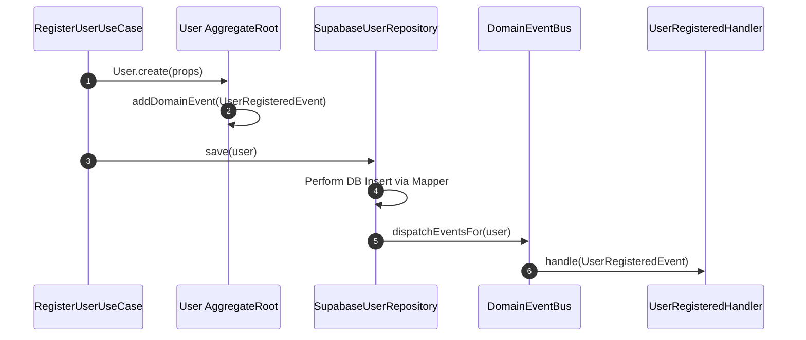

# Momenta Phase 01: Project Foundation, Architecture & Backend Core — Design Specification

**Date:** 2026-07-22  
**Status:** Approved  
**Author:** Lead Software Architect  

---

## 1. Executive Summary & Goals

Phase 01 establishes the production-grade engineering foundation for **Momenta**. The objective is to build a robust, scalable, type-safe Next.js (App Router) + Supabase infrastructure following strict **Clean Architecture**, **Domain-Driven Design (DDD)** bounded contexts, a **Shared Kernel**, **Domain Event Dispatcher**, **Value Objects**, **Mapper Patterns**, and strict dependency boundaries.

Zero business feature logic is implemented in Phase 01. The output is a verified, fully testable architectural foundation.

---

## 2. Directory Layout & Module Structure

```text
src/
├── app/                        # Next.js Presentation Layer (Thin Controllers / App Router)
│   ├── api/                    # Route Handlers (HTTP Validation & UseCase Invocation only)
│   │   └── health/             # Health check API
│   ├── layout.tsx
│   └── page.tsx
│
├── modules/                    # Domain-Driven Bounded Contexts
│   └── identity/               # Identity & Auth Bounded Context
│       ├── domain/             # Entities, Value Objects, Events, Repository Contracts
│       │   ├── entities/       # User.ts
│       │   ├── value-objects/  # UserId.ts, Email.ts, PasswordHash.ts, UserRole.ts
│       │   ├── events/         # UserRegisteredEvent.ts
│       │   └── repositories/   # IUserRepository.ts
│       ├── application/        # Use Cases, DTOs, Application Services
│       │   ├── dtos/           # RegisterUserDTO.ts, AuthenticateUserDTO.ts
│       │   ├── use-cases/      # AuthenticateUserUseCase.ts, RegisterUserUseCase.ts
│       │   └── services/       # IAuthService.ts
│       ├── infrastructure/     # Persistence, Supabase Adapters, Mappers
│       │   ├── mappers/        # UserMapper.ts (Domain <-> Supabase DB Row)
│       │   ├── repositories/   # SupabaseUserRepository.ts
│       │   └── services/       # SupabaseAuthService.ts
│       └── presentation/       # Context-specific UI components & hooks (if any)
│
├── shared/                     # Shared Kernel & Infrastructure Core
│   ├── domain/                 # Base Domain Building Blocks
│   │   ├── Entity.ts           # Abstract Base Entity
│   │   ├── ValueObject.ts      # Abstract Base Value Object
│   │   ├── AggregateRoot.ts    # Abstract Base Aggregate Root with Domain Event Collection
│   │   ├── DomainEvent.ts      # IDomainEvent Interface
│   │   ├── DomainEventBus.ts   # In-Memory / Async Event Bus
│   │   └── Result.ts           # Type-safe Result<T, E> Monad
│   │
│   ├── errors/                 # Centralized AppError Hierarchy
│   │   ├── AppError.ts         # Base Abstract Error
│   │   ├── ValidationError.ts  # Code: VALIDATION_ERROR (400)
│   │   ├── UnauthorizedError.ts # Code: UNAUTHORIZED (401)
│   │   ├── ForbiddenError.ts   # Code: FORBIDDEN (403)
│   │   ├── NotFoundError.ts    # Code: NOT_FOUND (404)
│   │   ├── ConflictError.ts    # Code: CONFLICT (409)
│   │   └── DatabaseError.ts    # Code: INTERNAL_ERROR (500)
│   │
│   ├── config/                 # Centralized Configuration & Environment Validation
│   │   ├── env.ts              # Zod Environment Schema & Safe Extractor
│   │   └── constants.ts        # System Constants & Limits
│   │
│   ├── logger/                 # Structured Logging Abstraction
│   │   ├── ILogger.ts          # Logger Interface Contract
│   │   └── PinoLogger.ts       # Pino JSON Implementation with Correlation IDs
│   │
│   └── infrastructure/         # Shared Database & HTTP Utilities
│       ├── supabase/           # Supabase Client Factories (Server, Browser, Middleware)
│       │   ├── server.ts
│       │   ├── client.ts
│       │   └── middleware.ts
│       └── http/               # HTTP Response Helpers & Handler Wrappers
│
└── middleware.ts               # Next.js Middleware (Session Validation & Route Guards)
```

---

## 3. Core Architectural Mechanisms

### 3.1 Result<T, E> Monad

All application use cases and domain methods return a `Result<T, E>` monad rather than throwing untyped exceptions for predictable control flow.

```typescript
export class Result<T, E extends Error = Error> {
  private constructor(
    private readonly _isSuccess: boolean,
    private readonly _value?: T,
    private readonly _error?: E
  ) {}

  public static ok<T, E extends Error = Error>(value?: T): Result<T, E> {
    return new Result<T, E>(true, value, undefined);
  }

  public static fail<T, E extends Error = Error>(error: E): Result<T, E> {
    return new Result<T, E>(false, undefined, error);
  }

  public get isSuccess(): boolean { return this._isSuccess; }
  public get isFailure(): boolean { return !this._isSuccess; }
  public get value(): T {
    if (!this._isSuccess) throw new Error("Cannot get value of a failure result");
    return this._value as T;
  }
  public get error(): E {
    if (this._isSuccess) throw new Error("Cannot get error of a success result");
    return this._error as E;
  }
}
```

---

### 3.2 Domain Event Bus System

Aggregate roots record domain events internally. Upon repository persistence or transaction completion, events are dispatched via `DomainEventBus`.



---

### 3.3 Domain-Driven Separation via Mappers

Domain Entities (`src/modules/*/domain/entities`) are completely decoupled from Supabase database tables or JSON structures. `UserMapper` converts back and forth explicitly.

```typescript
export class UserMapper {
  public static toDomain(raw: SupabaseUserRow): User {
    const idOrError = UserId.create(raw.id);
    const emailOrError = Email.create(raw.email);
    // ... validate and construct domain entity
    return User.reconstitute({ ... });
  }

  public static toPersistence(user: User): SupabaseUserRow {
    return {
      id: user.id.value,
      email: user.email.value,
      role: user.role.value,
      created_at: user.createdAt.toISOString(),
      updated_at: user.updatedAt.toISOString(),
    };
  }
}
```

---

## 4. Testing & Quality Tooling Setup

1. **Vitest**:
   - `vitest.config.ts` configured for fast ESM TypeScript unit and integration execution.
   - Global coverage target threshold configured at 90% for domain and application layers.
2. **Playwright**:
   - `playwright.config.ts` configured for browser E2E validation against Next.js dev/prod server.
3. **CI/CD (GitHub Actions)**:
   - Pipeline `.github/workflows/ci.yml` executes:
     - Install dependencies (`pnpm install`)
     - Type check (`pnpm run typecheck`)
     - Lint (`pnpm run lint`)
     - Unit & Integration tests (`pnpm run test:unit`)
     - Build application (`pnpm run build`)
     - Build documentation (`npm run build` inside docs workspace)

---

## 5. Architectural Decision Record Addendum (ADR-004)

- **ADR-004**: Adoption of Clean Architecture, Domain Event Bus, and Supabase Repository Mappers for Phase 01 Core Foundation.
- **Status**: Accepted
- **Context**: The application requires complete separation of persistence mechanisms (Supabase / PostgreSQL) from core domain rules.
- **Consequences**: Business logic is 100% testable in isolation without mocking Supabase client HTTP networks; changes to Supabase SDKs do not affect domain logic.
