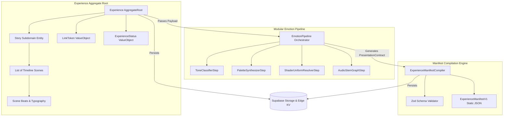
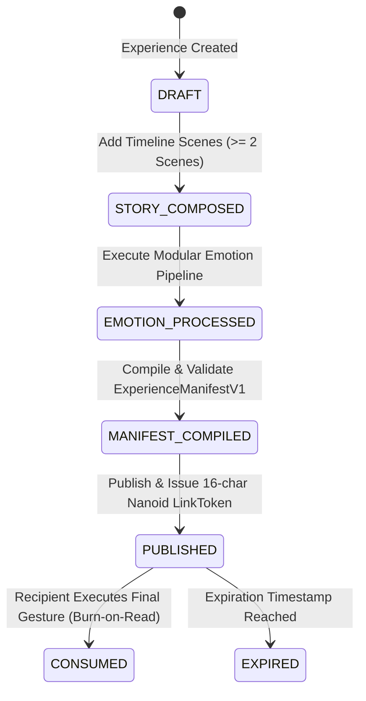

# Momenta Phase 02: Experience Authoring, Modular Emotion Pipeline & Manifest Generation — Design Specification

**Date:** 2026-07-22  
**Status:** Approved (With Mandatory Refinements)  
**Author:** Lead Software Architect  

---

## 1. Refined Executive Summary & Domain Scope

Phase 02 implements the authoring, sentiment synthesis, and compilation engine for **Momenta**. Based on mandatory architectural refinements:
1. **Aggregate Root**: `Experience` is the top-level aggregate root. `Story` is a subdomain entity contained within `Experience`.
2. **Modular Emotion Pipeline**: Replaces static emotion engines with an extensible pipeline (`IEmotionPipelineStep[]`) that processes text tone, color palettes, GLSL shaders, and WebAudio stems.
3. **Timeline-Based Scenes**: Story content is modeled as structured narrative **Scenes** (`Scene` with `SceneBeat` components, duration, entry/exit transitions) rather than simple flat nodes.
4. **Rich Presentation Contract**: Theme tokens expanded into a comprehensive contract (`PresentationContract` specifying colors, typography, GLSL uniforms, audio stem graphs).
5. **Manifest Versioning & Validation**: `ExperienceManifest` features explicit semver (`1.0.0`) and Zod schema validation.
6. **Expanded Lifecycle State Machine**: `DRAFT` $\rightarrow$ `STORY_COMPOSED` $\rightarrow$ `EMOTION_PROCESSED` $\rightarrow$ `MANIFEST_COMPILED` $\rightarrow$ `PUBLISHED` $\rightarrow$ `CONSUMED` / `EXPIRED`.
7. **Lifecycle Domain Events**: Domain events emitted at every state transition.
8. **Extensible Strategy Registries**: Extensible registries for Emotion Profiles (`IEmotionProfileRegistry`), Node/Scene Types (`ISceneTypeRegistry`), Gestures (`IGestureStrategyRegistry`), and Transitions (`ITransitionStrategyRegistry`).

---

## 2. Refined Domain Architecture & Aggregate Root



---

## 3. Experience Aggregate & Lifecycle State Machine



---

## 4. Code & Interface Specifications

### 4.1 LinkToken Value Object

```typescript
export class LinkToken extends ValueObject<{ value: string }> {
  private constructor(value: string) {
    super({ value });
  }

  public get value(): string { return this.props.value; }

  public static create(customToken?: string): LinkToken {
    const token = customToken || crypto.randomUUID().replace(/-/g, '').substring(0, 16);
    return new LinkToken(token);
  }
}
```

### 4.2 Presentation Contract (Enriched Theme Tokens)

```typescript
export interface PresentationContract {
  presetId: string;
  colors: {
    background: string;
    surfaceGlass: string;
    primaryText: string;
    secondaryText: string;
    accentGlow: string;
    borderGlass: string;
  };
  typography: {
    headerFontFamily: string;
    bodyFontFamily: string;
    baseFontSizePx: number;
    letterSpacing: string;
  };
  shader: {
    fragmentShaderKey: string;
    speed: number;
    noiseScale: number;
    intensity: number;
  };
  audio: {
    stemKey: string;
    bpm: number;
    fadeInSeconds: number;
    lowPassCutoffHz: number;
  };
}
```

### 4.3 Scene & Timeline Models

```typescript
export type SceneTransitionType = 'FADE_UP' | 'PARALLAX_SLIDE' | 'ZOOM_IN' | 'BLUR_REVEAL';

export interface SceneBeat {
  id: string;
  type: 'HEADING' | 'PARAGRAPH' | 'QUOTE' | 'PHOTO_BEAT';
  content: string;
  metadata?: Record<string, unknown>;
}

export class Scene extends ValueObject<{
  id: string;
  sequenceOrder: number;
  durationMs: number;
  transition: SceneTransitionType;
  beats: SceneBeat[];
}> {
  public get id(): string { return this.props.id; }
  public get sequenceOrder(): number { return this.props.sequenceOrder; }
  public get beats(): SceneBeat[] { return this.props.beats; }
}
```

### 4.4 Modular Emotion Pipeline & Registries

```typescript
export interface IEmotionPipelineStep {
  name: string;
  process(context: EmotionPipelineContext): Promise<EmotionPipelineContext>;
}

export interface EmotionPipelineContext {
  textBeats: string[];
  relationship: string;
  occasion: string;
  classifiedTone?: string;
  presentationContract?: PresentationContract;
}

export class EmotionPipeline {
  private steps: IEmotionPipelineStep[] = [];

  public addStep(step: IEmotionPipelineStep): this {
    this.steps.push(step);
    return this;
  }

  public async execute(initialContext: EmotionPipelineContext): Promise<EmotionPipelineContext> {
    let ctx = initialContext;
    for (const step of this.steps) {
      ctx = await step.process(ctx);
    }
    return ctx;
  }
}
```

---

## 5. Persistence Strategy & Tables

- `experiences` Table (Primary Aggregate Root table)
- `experience_scenes` Table (Timeline Scenes)
- `ExperienceMapper` (Translates `Experience` domain aggregate to DB rows and back cleanly).
