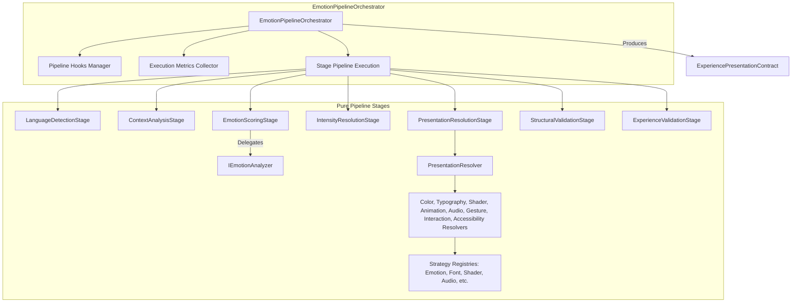

# Momenta Phase 03: Modular Emotion Pipeline & Experience Presentation Synthesis — Technical Design Specification (Refined)

**Date:** 2026-07-23  
**Status:** Approved (With Mandatory Refinements)  
**Author:** Lead Backend Engineer & System Architect  

---

## 1. Executive Summary & Architectural Overview

Phase 03 implements the **Modular Emotion Pipeline & Presentation Synthesis Engine** (`src/modules/emotion-engine`) for Momenta, incorporating mandatory architectural refinements for maximum extensibility, observability, maintainability, and domain isolation.

### Key Refinement Principles
1. **Contract Rename**: `ExperiencePresentationContract` represents the runtime presentation model for a published experience.
2. **Orchestrator Pattern**: `EmotionPipelineOrchestrator` coordinates stage execution, handles failures, emits domain events, collects timing metrics, and triggers pipeline extension hooks. Stage classes remain pure and decoupled.
3. **Pipeline Metadata**: Every `ExperiencePresentationContract` includes transient pipeline metadata (`engineVersion`, `themeVersion`, `analyzer`, `generatedAt`, `detectedLanguage`, `totalExecutionTimeMs`).
4. **Dual Validation Stages**:
   - `StructuralValidationStage`: schema, required fields, numeric ranges, registry references.
   - `ExperienceValidationStage`: contrast ratios, reduced-motion fallback, animation limits, asset presence.
5. **Interface-Based Registries**: Pure interface contracts (`IEmotionRegistry`, `IRelationshipRegistry`, `IOccasionRegistry`, `ITypographyRegistry`, `IShaderRegistry`, `IAnimationRegistry`, `IAudioRegistry`, `IGestureRegistry`) with zero switch statements.
6. **Dedicated Resolvers**: `PresentationResolver` delegates to focused sub-resolvers (`ColorResolver`, `TypographyResolver`, `ShaderResolver`, `AnimationResolver`, `AudioResolver`, `GestureResolver`, `InteractionResolver`, `AccessibilityResolver`).
7. **Rich Analyzer Output**: `IEmotionAnalyzer` returns `primaryEmotion`, `secondaryEmotion`, `confidence`, `emotionScores`, `valence`, `arousal`, `dominance`.
8. **Guaranteed Fallback Strategy**: `DefaultEmotionProfile` and `DefaultPresentationProfile` ensure valid contract generation under any inputs.
9. **Pipeline Hooks**: `IPipelineHook` exposing `beforePipeline`, `beforeStage`, `afterStage`, `beforeValidation`, `afterPipeline`.
10. **Zero Framework Leakage**: `src/modules/emotion-engine/domain` contains zero dependencies on Next.js, Supabase, HTTP, `process.env`, or Browser DOM.

---

## 2. Orchestrator & Pipeline Architecture



---

## 3. ExperiencePresentationContract & Metadata Schema

```typescript
export interface PipelineMetadata {
  engineVersion: "1.0.0";
  themeVersion: "1.0.0";
  analyzer: string;
  generatedAt: string;
  detectedLanguage: string;
  metrics: {
    languageDetectionMs: number;
    contextAnalysisMs: number;
    emotionScoringMs: number;
    intensityResolutionMs: number;
    presentationResolutionMs: number;
    structuralValidationMs: number;
    experienceValidationMs: number;
    totalExecutionTimeMs: number;
  };
}

export interface ExperiencePresentationContract {
  pipeline: PipelineMetadata;
  emotionProfile: {
    primaryEmotion: string;
    secondaryEmotion: string;
    confidence: number;       // 0.0 to 1.0
    valence: number;          // -1.0 to +1.0
    arousal: number;          // 0.0 to 1.0
    dominance: number;        // 0.0 to 1.0
    intensity: number;        // 0.0 to 1.0
    scores: Record<string, number>;
  };
  colors: {
    background: string;
    surfaceGlass: string;
    primaryText: string;
    secondaryText: string;
    accentGlow: string;
    borderGlass: string;
    ambientGradients: string[];
    contrastRatio: number;
  };
  typography: {
    headerFontFamily: string;
    bodyFontFamily: string;
    baseFontSizePx: number;
    letterSpacing: string;
    lineHeight: number;
  };
  shader: {
    fragmentShaderKey: string;
    speed: number;
    noiseScale: number;
    intensity: number;
    uniforms: Record<string, number | number[]>;
  };
  animation: {
    sceneTransitionType: string;
    entranceDurationMs: number;
    exitDurationMs: number;
    easingCurve: string;
    reducedMotionFallback: boolean;
  };
  audio: {
    stemKey: string;
    bpm: number;
    fadeInSeconds: number;
    fadeOutSeconds: number;
    lowPassCutoffHz: number;
    reverbMix: number;
  };
  gesture: {
    gestureType: string;
    triggerPromptText: string;
    completionFeedbackStyle: string;
  };
}
```

---

## 4. Analyzer & Registry Contracts

```typescript
export interface AnalyzerAnalysisResult {
  primaryEmotion: string;
  secondaryEmotion: string;
  confidence: number;
  emotionScores: Record<string, number>;
  valence: number;
  arousal: number;
  dominance: number;
}

export interface IEmotionAnalyzer {
  readonly id: string;
  analyze(textBeats: string[], relationship: string, occasion: string): Promise<AnalyzerAnalysisResult>;
}

export interface IPipelineHook {
  beforePipeline?(context: EmotionPipelineContext): Promise<void>;
  beforeStage?(stageName: string, context: EmotionPipelineContext): Promise<void>;
  afterStage?(stageName: string, context: EmotionPipelineContext, durationMs: number): Promise<void>;
  beforeValidation?(context: EmotionPipelineContext): Promise<void>;
  afterPipeline?(context: EmotionPipelineContext, contract: ExperiencePresentationContract): Promise<void>;
}
```

---

## 5. Domain Events

- `EmotionPipelineStartedEvent(experienceId, senderId)`
- `EmotionPipelineCompletedEvent(experienceId, primaryEmotion, totalExecutionTimeMs)`

---

## 6. ADR Recording

- **ADR-005**: Recorded in `docs/08_APPENDIX/ADRs.md` for `EmotionPipelineOrchestrator`, Interface Registries, and Deterministic On-The-Fly ExperiencePresentationContract Generation.
