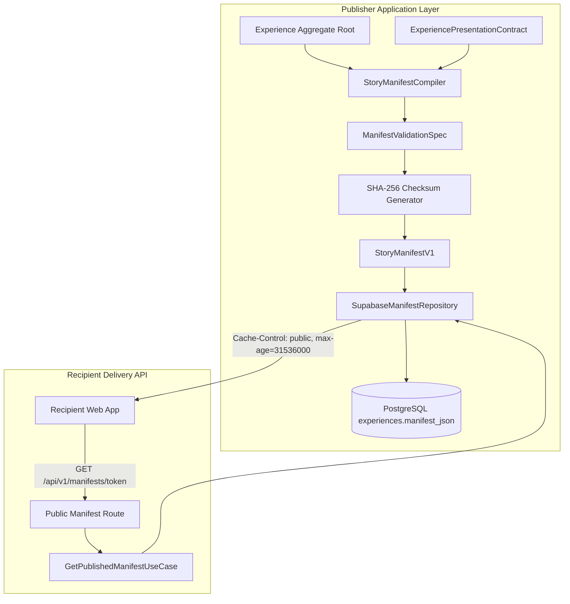

# Momenta Phase 04: Story Manifest Compiler Engine (`StoryManifestV1`) — Technical Design Specification

**Date:** 2026-07-23  
**Status:** Approved  
**Author:** Lead Backend Engineer & System Architect  

---

## 1. Executive Summary & Architecture Overview

Phase 04 implements the **Story Manifest Compiler Engine** (`src/modules/story-manifest`) for Momenta.

### Key Architectural Principles
1. **Immutable Static Document**: `StoryManifestV1` is a frozen, semver-versioned ("1.0.0") JSON document compiled when an Experience is published.
2. **Tamper-Evident SHA-256 Checksum**: Every manifest contains a deterministic `checksum` calculated over its normalized timeline beats and presentation tokens.
3. **Edge Storage & CDN Optimization**: Manifests are served to recipients in < 20ms with HTTP headers `Cache-Control: public, max-age=31536000, immutable`.
4. **Isolated Recipient Delivery**: Public unauthenticated access endpoint `GET /api/v1/manifests/[token]` decouples recipient consumption from sender database mutation routes.

---

## 2. StoryManifestV1 Schema

```typescript
export interface ManifestSceneBeat {
  sequenceOrder: number;
  durationMs: number;
  transitionType: string;
  textBeat: string;
}

export interface StoryManifestV1 {
  manifestVersion: '1.0.0';
  manifestId: string;
  experienceId: string;
  linkToken: string;
  senderDisplayName: string;
  relationship: string;
  occasion: string;
  publishedAt: string;
  scenes: ManifestSceneBeat[];
  presentation: ExperiencePresentationContract;
  checksum: string;
}
```

---

## 3. Data Flow Diagram



---

## 4. Components & Interfaces

### Compiler Interface
```typescript
export class StoryManifestCompiler {
  compile(
    experience: Experience,
    presentation: ExperiencePresentationContract,
    senderDisplayName?: string
  ): StoryManifestV1;
}
```

### Manifest Repository Contract
```typescript
export interface IManifestRepository {
  saveManifest(manifest: StoryManifestV1): Promise<void>;
  findByToken(linkToken: string): Promise<StoryManifestV1 | null>;
  findByExperienceId(experienceId: string): Promise<StoryManifestV1 | null>;
}
```

### Application Use Cases
1. `CompileAndPublishManifestUseCase`:
   - Accepts `experienceId` & `senderId`.
   - Fetches experience from `IExperienceRepository`.
   - Executes `EmotionPipelineOrchestrator` to generate `ExperiencePresentationContract`.
   - Compiles `StoryManifestV1` via `StoryManifestCompiler`.
   - Transitions experience status to `PUBLISHED` via `experience.publish()`.
   - Persists manifest to `IManifestRepository`.
   - Saves updated experience to `IExperienceRepository` (dispatches `ExperiencePublishedEvent`).
   - Returns `Result.ok(manifest)`.

2. `GetPublishedManifestUseCase`:
   - Accepts `linkToken`.
   - Queries `IManifestRepository.findByToken(token)`.
   - Returns `Result.ok(manifest)` or `NotFoundError`.

---

## 5. Summary of Files to Produce in Phase 04

1. **Domain Models & Contracts**:
   - `src/modules/story-manifest/domain/contracts/StoryManifestV1.ts`
   - `src/modules/story-manifest/domain/specifications/ManifestValidationSpec.ts`
   - `src/modules/story-manifest/domain/compiler/StoryManifestCompiler.ts`
   - `src/modules/story-manifest/domain/repositories/IManifestRepository.ts`
2. **Infrastructure Layer**:
   - `src/modules/story-manifest/infrastructure/repositories/SupabaseManifestRepository.ts`
3. **Application Layer**:
   - `src/modules/story-manifest/application/use-cases/CompileAndPublishManifestUseCase.ts`
   - `src/modules/story-manifest/application/use-cases/GetPublishedManifestUseCase.ts`
4. **Presentation API Controller**:
   - `src/app/api/v1/manifests/[token]/route.ts` (`GET`)
5. **Tests**:
   - `tests/modules/story-manifest/domain/StoryManifestCompiler.spec.ts`
   - `tests/modules/story-manifest/application/PublishManifestUseCase.spec.ts`
   - `tests/presentation/manifests-api.spec.ts`
